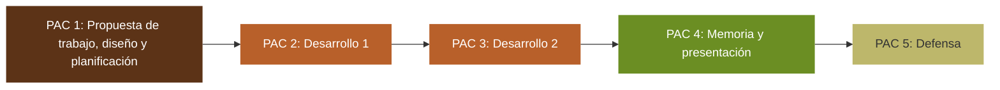

# ¿Qué es un Trabajo Final en los Estudios de Informática, Multimedia y Telecomunicación?

## ¿Qué es un trabajo final?

Un trabajo final (TF) es un **trabajo individual** que se lleva a cabo como último paso en la obtención de la mayoría de los títulos universitarios. Supone un reto apasionante que:

- supone una actividad teórico-práctica relacionada con la titulación.
- sirve de síntesis de las competencias, habilidades y conocimientos adquiridos en el resto de asignaturas del programa.
- suele tener una duración de un semestre, aunque en algunos programas puede ser de dos.
- tiene una carga considerable, normalmente de 12 a 18 créditos ECTS.

## Tipos de trabajos finales

Se puede diferenciar entre dos tipos de TF:

- Trabajo final de Investigación o TFR
- Trabajo final Profesionalizador/Empresarial o TFP

El recorrido de ambos tipos de trabajos es muy similar, e incluso puede ser difícil diferenciar entre uno y otro. A menudo, la principal diferencia será el seguimiento sistemático de una metodología de investigación en un TFR, o una más orientada a resultados en el caso de un TFP. Normalmente no es necesario que el/la estudiante explicite qué tipo de trabajo desarrolla.

### Trabajo final de Investigación o TFR

El/la estudiante realiza una investigación sobre una temática concreta dentro del ámbito de conocimiento escogido.

El producto de este trabajo es una contribución que puede tener diferentes formatos:

- conclusión: se demuestra una premisa
- solución tecnológica: se desarrolla una nueva forma de resolver un problema
- artículo científico
- otros

En los TFR es muy importante conocer la problemática a investigar a través de fuentes de información adecuadas (como bases de datos de artículos científicos) y la metodología de investigación que se aplica.

La metodología de investigación puede incluir una o varias de las siguientes técnicas:

- métodos cuantitativos: encuestas, análisis de datos, etc.
- métodos cualitativos: entrevistas, observaciones, etc.

Ejemplos de TFR pueden ser, entre otros:

- definición de un nuevo algoritmo de reconocimiento de personas a través de imágenes de su cara
- análisis del impacto de un elemento nuevo en un escenario (por ejemplo, realizar un experimento para ver si el uso de vídeos mejora el rendimiento de una asignatura)
- un caso de estudio
- una etnografía, etc.

### Trabajo final Profesionalizador/empresarial o TFP

El/la estudiante idea, desarrolla y documenta una solución a partir de un problema o necesidad. Esta necesidad puede ser real o simulada, pero siempre debe ser realista. Estos trabajos están focalizados en obtener un producto (la solución).

Los tipos de productos finales obtenidos en un TFP pueden ser muy diversos:

- un artefacto tecnológico
- un diseño
- un modelo de negocio
- un estudio de viabilidad
- una comparativa de diferentes herramientas o plataformas (benchmarking)
- la combinación de varios productos

La metodología de trabajo y documentación variará según el tipo de proyecto, herramientas y/o plataformas de desarrollo y tecnologías involucradas.

Ejemplos de TFP podrían ser:

- diseño e implementación de una app o una web
- análisis y comparativa de soluciones a un problema o necesidad

Los TFP pueden ser una buena oportunidad para aquellos/as estudiantes que tengan intenciones de emprendimiento.

## Recomendaciones generales

Antes de enfrentarse a su TF, se recomienda al/a la estudiante que tenga en cuenta los siguientes puntos:

- Es muy recomendable que el TF sea la última asignatura del programa de estudios que se cursa, y que, especialmente en el caso de grados, no se haga paralelamente a otras asignaturas.
- Es importante documentarse sobre la temática del TF **incluso antes de empezarlo**. Habrá que buscar y leer diferentes fuentes de información de calidad contrastada, tanto de base teórica como de carácter práctico. Es muy probable que estas fuentes estén en inglés.
- Utilizar los recursos que la UOC pone a disposición de los/as estudiantes. En este mismo documento mencionaremos algunos de ellos relacionados con cada etapa del TF.
- Mientras se está haciendo una etapa concreta del TF, es necesario pensar en las siguientes etapas. Esto permitirá tomar decisiones más acertadas.
- Es muy importante dar feedback del trabajo realizado a la persona que dirige/tutoriza el TF de forma periódica. Se aconseja que se haga de forma semanal. Muchos errores se podrán solucionar si la persona que dirige/tutoriza tiene la oportunidad de realizar una revisión rutinaria previa a la evaluación.
- Ejercitar una "mirada desde fuera" al trabajo realizado. Es decir, ser autocríticos con el trabajo propio.
- Recordar que el TF puede ser un documento significativo a nivel curricular en la carrera profesional del/de la estudiante y que puede servir como portafolio/mérito en la búsqueda de empleo.
- Considerar el TF como un producto que puede tener un recorrido más allá de lo propiamente académico: puede ser publicado en diferentes medios y utilizado por personas ajenas al mismo. Será positivo estudiar la posibilidad de su divulgación, consultando con la persona que lo dirige/tutoriza.
- Trabajar con margen de tiempo. Ser pesimista en la planificación.
- No presuponer, siempre comprobar

Etapas de un trabajo final

Las etapas de un TF se pueden distribuir en 5 PECs:

1. Propuesta de trabajo, diseño y planificación
1. Desarrollo 1
1. Desarrollo 2
1. Generación de la memoria y presentación
1. Defensa

Esta distribución de PECs puede ser diferente dependiendo de las necesidades del programa

- área de TFs. Por ejemplo: la PEC 1 puede presentarse en 2 PECs diferentes (propuesta por un lado, y diseño y planificación por otro), o se pueden distribuir los contenidos y objetivos de forma diferente; también se pueden introducir más de 2 PECs de desarrollo del trabajo, etc.

#### Documentación destacada

- [Haz un trabajo final](https://biblioteca.uoc.edu/es/estudiantes/supera-con-exito-las-actividades-y-los-trabajos-finales/haz-un-trabajo-final/index.html)
- [Herramientas para elaborar tu trabajo final](https://biblioteca.uoc.edu/export/sites/biblio/.galleries/documents/tabla-periodica-tf-es.pdf)

### PEC 1: Propuesta de trabajo, diseño y planificación

Esta primera fase tiene como principal objetivo definir cuál es la temática del trabajo y qué se quiere conseguir al finalizar el TF, además de justificar su interés y/o relevancia, y finalmente definir la metodología y las tareas que se realizarán para completarlo así como su planificación.

Primero debe definirse la temática del TF. El asesoramiento y una buena comunicación con la persona que dirige/tutoriza el trabajo es esencial en esta fase.

Una vez clara la temática del TF es necesario contextualizar el proyecto, definir lo que se quiere conseguir al finalizarlo (objetivos), la metodología a seguir y el trabajo a realizar (planificación), así como analizar su impacto en aspectos de sostenibilidad, ética y diversidad.

El resultado de esta primera PEC podría ser un primer esbozo del _abstract_ y un informe que podrá formar parte de la memoria final. El informe debería incluir los siguientes apartados:

- **Contextualización:**
- **TFR:** será necesario realizar lo que se llama un “estado del arte”, es decir, una búsqueda bibliográfica con las herramientas adecuadas para identificar qué trabajos previos existen en el campo son más relevantes, justificando la aproximación que se propone.
- **TFP:** habrá que realizar un análisis de mercado detectando, entre otros:
- Oportunidades
- Herramientas
- Competidores

La contextualización, puede incluir la motivación para realizar este trabajo final. Por ejemplo: "este trabajo intenta resolver una necesidad que nos encontramos en mi trabajo", o "este trabajo intenta comprobar una percepción sobre la calidad de una herramienta que se utiliza en mi ámbito profesional".

- **Objetivos**: Una vez se conoce la contextualización del problema planteado, se decide lo que se quiere conseguir con el proyecto que se plantea. Se debe ser realista y tener en cuenta el tiempo del que se dispone y las competencias del/de la estudiante.
- **Impacto en aspectos de sostenibilidad, ética y diversidad**: a partir de las preguntas que se proponen en la guía correspondiente, el/la estudiante debe trabajar la competencia transversal UOC “Comportamiento ético y global”.
- **Planificación**: después de definir los objetivos y el impacto se propone una planificación de las tareas que se desarrollarán en el TF. Para eso es necesario:
- Identificar las tareas concretas a desarrollar
- proponer su temporización, teniendo en cuenta la experiencia y conocimientos previos del alumno, la complejidad de las tareas, el calendario propuesto, etc.
- Es importante planificar tanto horizontalmente (dimensión tiempo) como verticalmente (priorización), valorando los posibles riesgos que se pueden presentar que impidan seguir el plan. También deben plantearse alternativas para superarlos.

Se aconseja que la duración de la PEC1 sea de 2 a 3 semanas.

Dependiendo de las necesidades del programa, esta PEC se puede dividir en 2: una de propuesta (máximo 1 semana) donde se hace el primer esbozo del _abstract_, y otra de diseño y planificación (1 o 2 semanas) donde se elabora el informe antes descrito.

#### Documentación destacada

- [Infografía: Citas bibliográficas para torpes](https://neoscientia.com/citas-bibliograficas/)
- Guía para el análisis del impacto en aspectos de sostenibilidad, ética y diversidad (documento adjunto)

#### Herramientas para esta etapa

- **Bases de datos bibliográficas o fuentes de información adecuadas:** la persona que dirige/tutoriza el TF normalmente proporcionará una bibliografía inicial. Se recomienda ampliar esta documentación mediante la web de la **[**biblioteca de la UOC**](https://biblioteca.uoc.edu/ca/).** Es muy importante elegir fuentes de información contrastadas.
- **Bibliografía:**
- [Cómo citar](https://biblioteca.uoc.edu/es/pagina/Como-citar/)
- [**Gestores de bibliografía:**](http://recursosaprenentatge.aula.uoc.edu/gestors-bibliografics/)
- [Zotero](https://www.zotero.org/):
  - Compatible con [Word](https://www.zotero.org/support/word_processor_plugin_usage), [LibreOffice](https://www.zotero.org/support/word_processor_plugin_installation) y [Google Docs](https://www.zotero.org/support/google_docs)
  - No es compatible con OpenOffice.
- [Mendeley](https://biblioteca.uoc.edu/ca/Colleccio-digital-per-arees-destudi/collecio/Mendeley/):
  - Compatible con [Word](https://www.mendeley.com/guides/mendeley-cite/), [LibreOffice](https://www.mendeley.com/guides/using-citation-editor/)
  - Incompatible con [Google Docs](https://service.elsevier.com/app/answers/detail/a_id/28824/supporthub/mendeley/~/does-mendeley-cite-work-with-google-docs%3F/) y OpenOffice
- El editor de textos científicos [LaTeX](https://www.latex-project.org/get/) incluye su propio gestor de bibliografía.
- **Herramientas de planificación:**
- [Team Gantt](https://www.teamgantt.com/)
- [Gantter](https://www.gantter.com/)
- [GanttProject](https://www.ganttproject.biz/)
- [Project Libre](https://www.projectlibre.com/)

### PEC 2 y 3: Desarrollo del proyecto\*\*

Una vez definidas las tareas y la temporización, llega el momento de desarrollarlas. Durante el desarrollo es muy recomendable que haya varias entregas previas a la entrega definitiva, que servirán a la persona que dirige el trabajo para guiar al/a la estudiante. Por eso se ha dividido el proceso en 2 PECs. Esta división puede ser diferente en función de las necesidades de cada programa o área de TFs.

Aunque la redacción de la memoria tiene una PEC específica, es importante que el/la estudiante no deje todo el trabajo de redacción por el final. Desde la PEC 1, y sobre todo a medida que se desarrollen las PECs 2 y 3, es buena idea ir escribiendo la memoria como una documentación de los pasos seguidos.

Se recomienda que la duración de las PECs 2 y 3 sea de 8-9 semanas en su conjunto.

#### Herramientas para esta etapa

En esta etapa se utilizarán las herramientas propias del área del TF que sean necesarias para el desarrollo del mismo.

Además, es interesante utilizar herramientas de gestión de tareas y planificación:

- [Trello](https://trello.com/)

### PEC 4: Memoria y presentación\*\*

La **memoria** es una forma de reportar los aspectos claves del proyecto. Se facilita una plantilla que propone los apartados que debería incluir la memoria del trabajo, y una pequeña descripción de éstos.

Evidentemente, algunas partes de la memoria se redactan en las PECs 1, 2 y 3. Hay que insistir en que no debe dejarse toda la redacción de la memoria por el final.

Se aconseja que la extensión de un TF sea de unas 60 páginas, y que en ningún caso supere las 90 (en este límite no se incluyen los anexos). Es importante realizar un esfuerzo de síntesis, sin quedar corto en la exposición de las ideas necesarias, y utilizar ayudas visuales (fotografías, esquemas, gráficas) para ilustrar lo que se explica.

Además de la memoria**,** el/la estudiante debe hacer una **presentación** que resuma, en 20 minutos, los aspectos más importantes de su trabajo. Esta presentación debe tener las siguientes características:

- **No se puede editar el vídeo de la presentación**: según la normativa de la UOC, el vídeo de la presentación del TF deberá estar grabado sin interrupciones o cortes ni edición posterior. Se puede repetir el vídeo tantas veces como se quiera, pero no editarlo después de grabarlo ni hacer un vídeo largo a partir de vídeos más cortos.
- **Se recomienda que el/la estudiante añada una ventana donde se vea su cara mientras presenta**: Aparte de garantizar la identidad de la persona que presenta, la gestualidad y la expresión pueden ayudar a hacer llegar de forma más clara el mensaje que se quiere transmitir.

Se recomienda que la duración de la PEC 4 sea de 2-3 semanas.

#### Herramientas para esta etapa

Se pueden utilizar diferentes programas de tratamiento de textos, y se recomienda aquellos que pueden integrar un gestor de bibliografía, como Word (con Mendeley, Zotero) o LaTeX (que tiene su propio gestor de bibliografía).

- Documentación:
- Memoria
  - [Cinco consejos para mejorar la redacción de tus trabajos académicos](https://biblioteca.uoc.edu/es/actualidad/noticia/Cinco-consejos-para-mejorar-la-redaccion-de-tus-trabajos-academicos/)
  - [Redacción de textos científicos](https://materials.campus.uoc.edu/cdocent/_D_CBBU62JZTHQ9CQQGJ.pdf)
  - Plantilla (documento adjunto)
- Presentación
  - [Presentación de documentos y elaboración de presentaciones (Roser Beneito)](https://discovery.biblioteca.uoc.edu/permalink/34CSUC_UOC/1asfcbc/alma991000471059706712)
- Editores de texto/presentaciones:
- [Office365](https://cv.uoc.edu/estudiant/acollida/es/campus/pindoles/office365.html): Compatible con Zotero y Mendeley
- [Google Docs](https://docs.google.com/document/u/0/?tgif=d): Compatible con Zotero
- [LibreOffice](https://es.libreoffice.org/): Compatible con Zotero y Mendeley
- [LaTeX](https://www.latex-project.org/get/): Tiene su propio gestor de bibliografía
- [Overleaf](https://www.overleaf.com/) es un entorno online para la edición en LaTex. Permite trabajar de forma colaborativa. Es muy útil si se quiere compartir el trabajo con la persona que lo tutoriza/dirige.
- Grabación de la pantalla:
- [OBS Studio](https://obsproject.com/)
- [Zoom](https://zoom.us/)

### PEC 5: Defensa

Dado el cariz académico del TF, es necesaria una evaluación diferente a la de otras asignaturas. Esta evaluación consiste en la **defensa del TF ante una comisión evaluadora**. En la defensa, las personas que componen la comisión evaluadora revisan de forma individual los materiales entregados como resultado del TF, en concreto la memoria y la presentación, y formulan preguntas al/a la estudiante para evaluar el grado de madurez y conocimiento del trabajo realizado.

En el período final del semestre se designará un calendario en el que se producirán las defensas.

Las defensas serán diferentes en el caso de Trabajos Finales de Grado y Máster.

#### Defensas de Grado

La defensa se realizará de manera **asíncrona**, usualmente a través de **la herramienta Present@ o en el foro del aula**:

- La **comisión evaluadora** estará formada por 2 o 3 personas. Una de éstas será la persona que dirige del trabajo, y otra debe ser un/a PRA (profesor/a responsable de la asignatura) o un/a PA (profesor/a asociado/a).
- El/La estudiante colgará en el Present@ o en el foro el vídeo de la presentación, y un enlace a la memoria, de forma que los componentes de la comisión evaluadora puedan consultarla.
- Los componentes de la comisión evaluadora revisarán la memoria y presentación antes del período de defensa asignado.
- Cuando comience el período de defensa, los componentes de la comisión evaluadora harán preguntas al/a la estudiante en el Present@ o en el foro del aula, ya sea por turnos o todos a la vez. El/La estudiante tendrá que responder en un tiempo razonable para facilitar el debate. Este tiempo lo fijará el/la PRA (profesor/a responsable de la asignatura).
- Los componentes de la comisión evaluadora pueden realizar más preguntas si lo consideran necesario después de leer las respuestas del/de la estudiante. La defensa concluirá cuando los componentes de la comisión evaluadora no tengan más preguntas.
- Los componentes de la comisión evaluadora generarán el acta de evaluación del/de la estudiante, que será entregada al/a la estudiante por la persona que dirige/tutoriza el trabajo a través del RAC.

#### Defensas de programas propios

La defensa se realizará de manera **asíncrona**, usualmente a través de **la herramienta Present@ o en el foro del aula**:

- La comisión evaluadora estará formada por 2 personas, una de las cuales será la persona que dirige el trabajo y la otra es un/a PRA (profesor/a responsable de la asignatura) o PA (profesor/a asociado/a).
- El/La estudiante colgará en el Present@ o en el foro el vídeo de la presentación, y un enlace a la memoria, de forma que los componentes de la comisión evaluadora puedan consultarla.
- Los componentes de la comisión evaluadora revisarán la memoria y presentación antes del período de defensa asignado.
- Cuando comience el período de defensa, los componentes de la comisión evaluadora harán preguntas a los/las estudiantes en el Present@ o en el foro del aula, ya sea por turnos o todos a la vez. El/La estudiante tendrá que responder en un tiempo razonable para facilitar el debate. Este tiempo lo fijará el/la PRA (profesor/a responsable de la asignatura).
- Los componentes de la comisión evaluadora pueden realizar más preguntas si lo consideran necesario después de leer las respuestas del/de la estudiante. La defensa concluirá cuando los componentes de la comisión evaluadora no tengan más preguntas.
- Los componentes de la comisión evaluadora generarán el acta de evaluación del/de la estudiante, que le entregará la persona que dirige/tutoriza el trabajo a través del RAC.

#### Defensas de Máster

La defensa se realizará de manera **síncrona** usualmente a través de **la herramienta BlackBoard Collaborate**:

- La comisión evaluadora estará formada por 3 componentes. Uno de los componentes debe ser un/a PRA (profesor/a responsable de la asignatura) o PA (profesor/a asociado/a). La persona que dirige el trabajo podría ser uno de esos componentes.
- Antes de la defensa, el/la estudiante se asegurará de que los componentes de la comisión evaluadora pueden acceder tanto a la presentación como a la memoria. Puede hacerlo colgando el vídeo de la presentación en la herramienta Present@ en el aula y añadiendo un enlace a la memoria, o bien puede compartir con todos los miembros de la comisión evaluadora una carpeta de Google Drive con la documentación.
- Antes de la defensa, los componentes de la comisión evaluadora revisarán la memoria y la presentación entregadas.
- En el momento de la defensa se validará la identidad del/de la estudiante.
- Una vez validada la identidad, los distintos componentes de la comisión evaluadora realizarán las preguntas que consideren necesarias para evaluar la madurez de las respuestas y el conocimiento del trabajo. Lo harán por turnos, y en cada turno puede hacer varias preguntas, de forma que se establezca un debate con el/la estudiante centrado en el trabajo presentado.
- La defensa tendrá una duración de unos 20 minutos
- Es posible que algunos de los componentes de la comisión evaluadora participen en la defensa de forma asíncrona. En este caso, estos componentes harán llegar sus preguntas a priori al resto de la comisión, que las planteará en su nombre. La defensa quedará grabada, de modo que los componentes de la comisión evaluadora que participan de forma asíncrona puedan evaluar las respuestas del/de la estudiante a sus preguntas.
- Al finalizar la defensa, los componentes de la comisión evaluadora elaborarán el acta de evaluación del/de la estudiante, que le entregará la persona que dirige/tutoriza el trabajo a través del RAC.

#### Documentación destacada

- [5 formas de mejorar tus habilidades comunicativas](https://forbes.es/lifestyle/10264/5-maneras-de-mejorar-tus-habilidades-comunicativas/)
- [La web de defensas de los trabajos finales de la UOC](https://campus.uoc.edu/webapps/campus/estudiant/estudiant/defensestf/es/index.html)
- [La defensa síncrona de TFM](https://youtu.be/vTM2-C-2KiE)

### Directrices y recomendaciones referentes a la memoria

La memoria del TF debe cumplir una serie de directrices de estilo formales:

- Debe estar escrita en un único idioma (español, catalán o inglés), con excepción de ciertos apartados especiales, como el _abstract_ (o resumen).
- El texto debe estar libre de errores gramaticales, sintácticos, semánticos y ortográficos.
- Se recomienda utilizar la plantilla de memoria facilitada desde los EIMT. La plantilla es un modelo base para la documentación del TF y tiene finalidades orientativas: el/la estudiante puede adaptarla y modificarla para adecuarse a sus necesidades. Sin embargo, se recomienda mantener la estructura propuesta.
- El estilo de escritura debe ser formal, utilizando un lenguaje académico. Debe utilizarse una forma impersonal, evitando el uso de la primera persona del singular y del plural.
- La memoria debería apostar por un uso flexible del lenguaje inclusivo.
- Hay que redactar el TF de forma que sea cómoda y fácil su lectura. Las siguientes indicaciones ayudan a conseguirlo:
- Se deben evitar oraciones demasiado largas. Las frases cortas ayudan a ser conciso y claro a la hora de contar las cosas.
- Se recomienda utilizar listas de puntos o numeradas cuando sea necesario
- Se recomienda utilizar sistemas de énfasis (como negritas)

Se deben tener muy en cuenta los siguientes puntos de formato del documento:

- La alineación del texto debe ser de tipo “justificada” , y se pide utilizar doble espaciado.
- Todas las páginas deben estar numeradas.
- Es necesario un índice de contenido, pero también un índice de tablas y uno de figuras.
- Todas las tablas y figuras (i.e. imágenes) deben ser citadas en el texto, y deben tener un pie de página que describa brevemente lo que ilustran.
- Si alguna tabla o figura ha sido realizada por una tercera persona, debe citarse la fuente original. Siempre deben respetarse los derechos de autor que pueda tener. No seguir esta indicación puede ser considerado plagio, y tendría unas consecuencias muy graves para el/la estudiante
- Si hay ecuaciones o fórmulas, deben ser numeradas para poder ser referenciadas en el texto.
- Los últimos capítulos de la memoria deben ser la bibliografía, y los posibles anexos, en este orden.
- Los ítems bibliográficos que aparecen en el capítulo de Bibliografía deben estar escritos correctamente y siguiendo el formato marcado por los estándares de citación. Este formato debe ser consistente en todo el documento. Los estándares de cita indican cómo deben estar ordenados los ítems bibliográficos (por orden de aparición y cita a lo largo del texto, o bien alfabéticamente), cómo tratar varias entradas del mismo autor, etc. Se recomienda utilizar herramientas de citación mencionadas en la PEC1.
- Si un elemento bibliográfico no se cita en el texto, no puede aparecer en la bibliografía.

Se recomienda:

- Hacer el ejercicio de leer la memoria una vez escrita como si la leyera un hipotético lector/usuario.
- Evitar una gran complejidad o profundidad en la estructura de los capítulos. Si la profundidad de la estructura va más allá de Capítulo/Apartado/Subapartado, es decir, tres niveles de profundidad, es probable que la legibilidad y orden de los contenidos se vean mermados.
- Utilizar anexos, especialmente si se desea incluir un alto volumen de imágenes o código o información como encuestas que, de estar en el cuerpo de la memoria, dificultarían la lectura.
- En caso de incluir código en los anexos, valorar la posibilidad de utilizar un repositorio externo (como github o gitlab).
