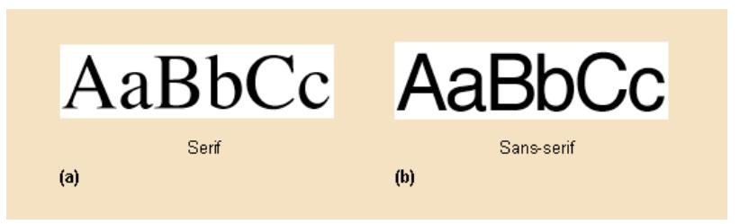
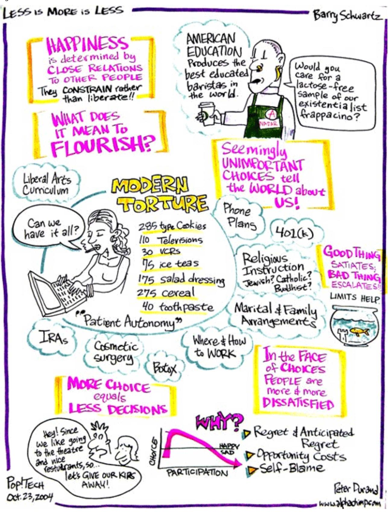
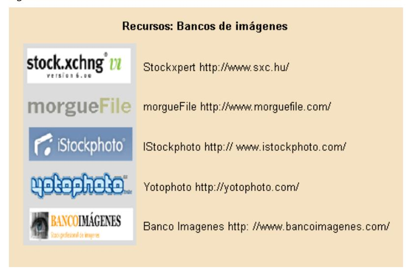
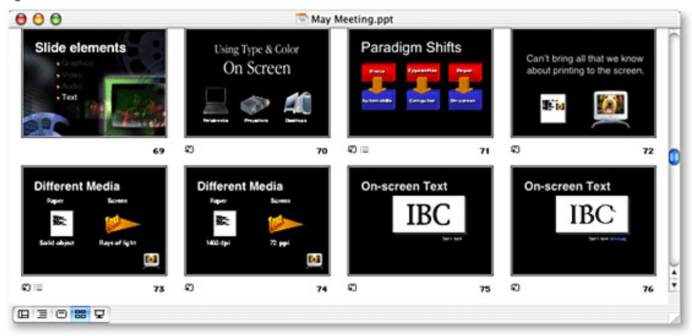
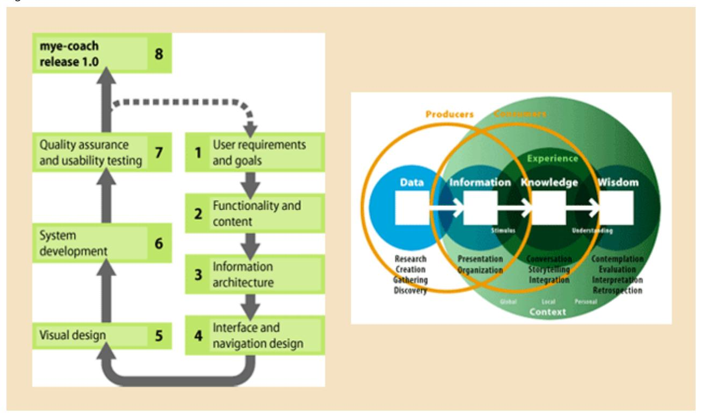
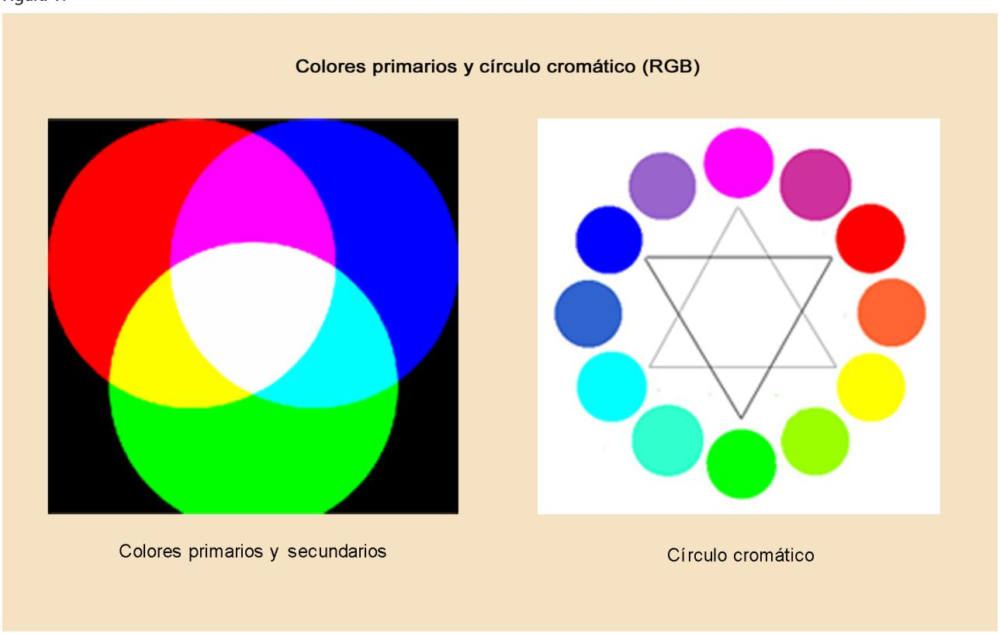
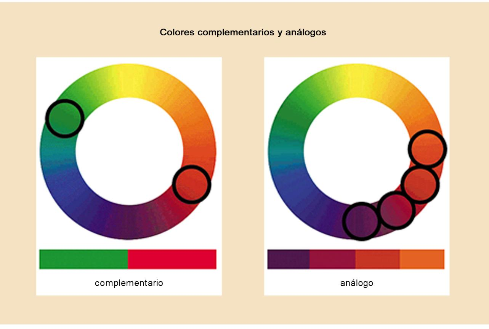
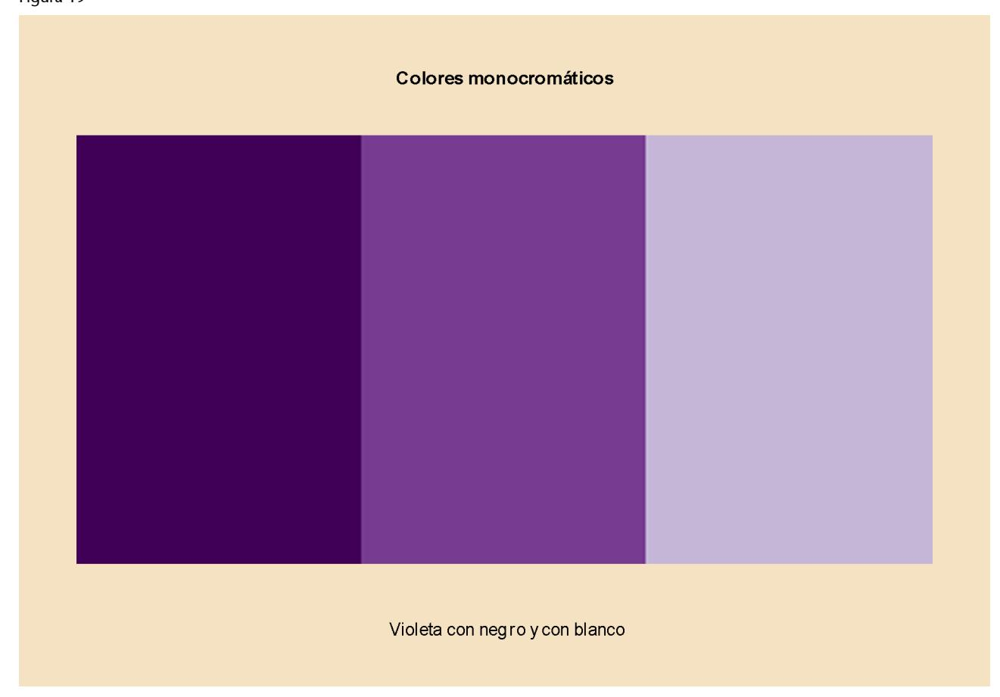
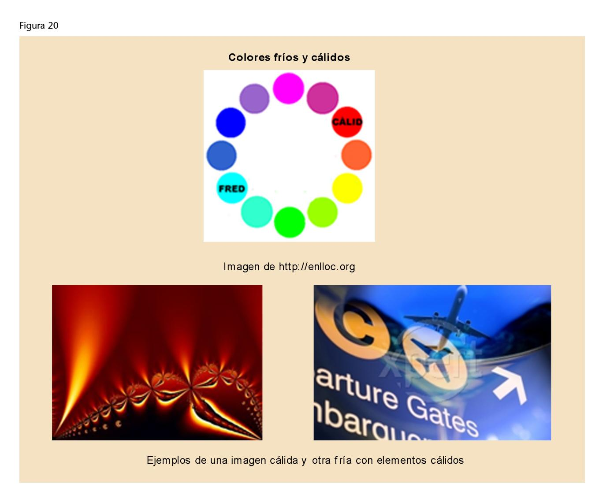
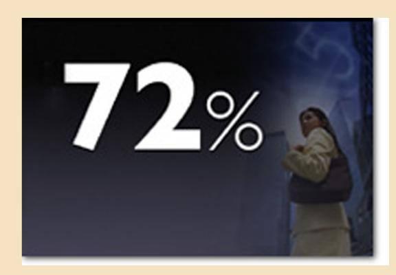

# Presentación de documentos y elaboración de presentaciones

Roser Beneito Montagut

# **Introducción**

En este material os daremos algunas indicaciones de cómo elaborar, desde un punto de vista formal, un documento académico y una presentación de un proyecto para que funcione como material de apoyo en una presentación oral. Es decir, os mostraremos todas aquellas características formales que hacen que nuestro documento o nuestra presentación tengan una coherencia efectiva entre forma y contenido y sean visualmente agradables.

De hecho, seguro sabéis que elementos como una buena presentación (entendida como aspecto visual), un buen tratamiento tipográfico, un buen formato, sangrado, interlínea, etcétera, pueden mejorar la calidad de nuestro documento o de nuestra presentación, en tanto que lo que pretendemos es hacerle más cómoda la lectura al lector/a (receptor/a) y facilitarle la compresión de lo que queremos decir.

En este texto os mostraremos, precisamente, todos estos elementos. Así tendréis unas pautas sencillas y claras de cómo dar formato a un documento. De hecho, os mostraremos cómo maquetar un documento, lo cual incluirá desde escoger el tipo de letra hasta cómo hacer los márgenes o el espaciado.

Después, en la segunda parte, os daremos unas recomendaciones para hacer presentaciones que sirvan de apoyo visual a las exposiciones, ponencias o presentaciones orales. Estas pautas son también fundamentales a la hora de preparar una presentación y os servirán tanto en el ámbito académico como en el terreno laboral.

# **1. Presentación de documentos: dar formato al trabajo**

En esta primera parte del material nos detendremos a ver, paso a paso, cómo tenemos que maquetar un documento de trabajo. Estas pautas se pueden aplicar a cualquier documento formal, desde la memoria de un trabajo final de carrera (TFC) hasta un análisis funcional. Son, por lo tanto, reglas comunes que podréis aplicar a cualquier documento que tengáis que redactar a partir de ahora; por tanto, aunque parezca un aspecto secundario, es de gran importancia tener todas estas recomendaciones presentes a la hora de redactar, estructurar y dar forma a nuestro documento.

Pero para empezar, abordaremos unas partes fundamentales en el proceso de redacción: estructurar, revisar y corregir.

## **1.1. Estructura del documento**

Un buen contenido sin una forma adecuada dificultará la lectura y el análisis del trabajo a las personas encargadas de leerlo y evaluarlo. Aunque a menudo hay que redactar y organizar la información según las normas específicas que se hayan dado (por ejemplo, en un TFC el director del trabajo sería quien daría estas indicaciones; y en un análisis funcional podría ser el cliente), existe una serie de elementos y apartados en los trabajos que son muy generales y que se suelen aplicar a varios tipos de documentos.

Estos elementos genéricos que se aplicarían a cualquier tipo de documento son:

- **Portada**. Debe mostrar el título del trabajo, el tema o asignatura a la que corresponde dicho trabajo, la fecha de realización y el nombre del autor. También puede contener el nombre de la persona a quien se entrega el trabajo y la escuela, departamento o empresa donde se hace la entrega.
- **Índice**. Es la relación ordenada de los apartados y subapartados que contiene el trabajo con su número de página.
- **Introducción**. Se trata de una pequeña descripción de la finalidad y los objetivos del trabajo, de la motivación, del alcance y su justificación. Aquí también situamos una presentación del trabajo de carácter general y los comentarios que consideremos oportunos para contextualizar el trabajo.

- • **Cuerpodeldocumento**. Es el trabajo en sí, la parte que corresponde al contenido del trabajo. Éste estará dividido en tantos subapartados como sean necesarios.
- **Conclusiones**. Es la parte en que se indica dónde habéis podido llegar después de hacer el trabajo, qué habéis constatado, qué habéis observado o qué os habéis encontrado.
- **Anexos**. Aquí encontramos toda aquella información que es interesante pero que rompería la presentación lógica y ordenada si se pusiera en el cuerpo del documento. Además de los materiales complementarios.
- **Bibliografía**. Contendrá la relación de las fuentes utilizadas para hacer el trabajo: libros, revistas, páginas web, etc.

# **1.2. Revisión del documento: la última fase antes de empezar a dar forma al documento**

Una vez estructurado y redactado el trabajo, todavía no hemos acabado: se tiene que revisar. Muchas veces olvidamos hacer una revisión exhaustiva del documento que estamos elaborando, y ésta es una parte fundamental posterior a la fase de escritura. De hecho, la revisión en sí no debe dejarse exclusivamente para el final, sino que debemos ir haciendo revisiones mientras redactamos, aunque insistimos en la necesidad de una revisión final.

Cabe decir que revisar no siempre es fácil, ya que como autores estamos muy implicados con el texto. Sin embargo, podemos utilizar algunos métodos bien sencillos para evitar los errores y minimizarlos en el documento final.

Sin embargo, antes de continuar, tenemos que responder una pregunta: ¿qué entendemos por revisión? Al revisar un texto no sólo pretendemos detectar y corregir errores, sino también cuestiones de contenido, estructura y estilo. Debemos asegurarnos de que no hemos perdido de vista la finalidad de nuestro trabajo, que continúa quedando claro cuál es el tema principal y que exponemos de manera clara nuestros objetivos o intenciones. Tenemos que comprobar que la organización del documento es coherente (títulos, subtítulos, índice, párrafos) y que, al mismo tiempo, el texto tiene una unidad.

Y una vez visto qué es revisar, y que no es fácil hacerlo, veamos algunas estrategias:

• Lo primero que podemos hacer es que otra persona lea nuestro texto y que nos de unas primeras impresiones de lo que ha leído. No os preocupéis si vuestro texto es muy especializado y el lector no sabe nada del tema: en ese caso, no estamos revisando el contenido, sino que intentamos evitar aquellos errores que nosotros mismos no encontraríamos aunque leyéramos el documento mil veces.

- Otra buena opción es leer el texto en voz alta intentando entonar al máximo, como si lo estuvierais leyendo ante una audiencia. Haced la prueba y veréis cómo al final cambiáis signos de puntuación, descubrís frases que no se acaban de entender, corregís errores de sintaxis, e incluso errores tipográficos (éstos, aunque son habituales, dan una mala impresión a quien está leyendo el texto, ya que parece que ha faltado, justamente, esta última revisión). El hecho de leer el texto en voz alta también nos permite distanciarnos un poco más del mismo. Cuando llevamos mucho tiempo preocupados y trabajando constantemente en un documento podemos perder la perspectiva y volvernos incapaces de ver nuestros errores y vicios de escritura. Por eso, leer el texto en voz alta es un buen ejercicio, ya que justo en aquel momento dejamos de leer automáticamente lo que tenemos en la cabeza y pensamos que estamos comunicando y pasamos a leer lo que realmente hay escrito en el papel.
- Finalmente, tanto para la redacción como para la corrección, es imprescindible tener a mano lo que se llaman "herramientas del escritor": diccionarios, normas gramaticales y ortográficas, conjugaciones verbales, repertorios de léxico especializado e incluso algún libro de estilo. Adquirir como hábito consultar estos recursos nos será de gran ayuda.

En el cuadro siguiente tenéis una serie de recursos que os pueden ser muy útiles.

#### **Recursos**

#### **Diccionarios**

[el Instituto de Estudios Catalanes](http://dlc.iec.cat/)

[RAE](http://www.rae.es)

[Gran Diccionario de la Lengua Catalana \(GDLC\)](http://www.grec.net/home/cel/dicc.htm)

Diccionarios Vox en línea (*[Diccionario general de la lengua española](http://www.diccionarios.com)* y el *Diccionario de [sinónimos y antónimos de la lengua española](http://www.diccionarios.com)*, el *Advanced English Dictionary*, el *Diccio[nario esencial Français-Espagnol /](http://www.diccionarios.com)* Español-Francés y el *Diccionario manual Castellano-[Catalán / Català-Castellà\)](http://www.diccionarios.com)*

[Asesoramiento lingüístico. Web de la Lengua Catalana. Generalitat de Cataluña](http://www20.gencat.cat/portal/site/Llengcat/menuitem.0ee0bcc77434e6b0a2fd1210b0c0e1a0/?vgnextoid=947501713ef61110VgnVCM1000000b0c1e0aRCRD&vgnextchannel=947501713ef61110VgnVCM1000000b0c1e0aRCRD&vgnextfmt=default)

#### **Basesdedatosterminológicas**

[Termcat](http://www.termcat.cat/biblioteca/index.html)

[CE: Eurodicautom](http://eurodic.ip.lu)

[IEC: Portal de Datos Lingüísticos](http://pdl.iec.es)

#### **Boletineslingüísticos**

[Fichero lingüístico \(UPC\)](http://www.upc.es/slt/fl/fl.html)

[Signos \(URL\)](http://www.url.es/cat/in00303.htm)

[Servicios lingüísticos universitarios Universidad de Alicante \(UA\)](http://www.ua.es/spv)

[Universidad Autónoma de Barcelona \(UAB\)](http://www.uab.es/gab-llengua-catalana/index.html)

[TRACES. Base de datos de filología catalana](http://www.traces.uab.es/tracesbd/default.htm)

[Universidad de Barcelona \(UB\)](http://www.ub.es/slc/servei.htm)

[DAU, Universidad de Barcelona](http://www.ub.es/slc/dau/inici.htm)

[Universidad de Gerona \(UdG\)](http://www.udg.edu/llengues/)

[Universidad de las Islas Baleares \(UIB\)](http://www.uib.es/secc6/slg/)

[Universidad Jaume I \(UJI\)](http://sic.uji.es/uji/org/slt.html)

[Universidad de Lérida \(UdL\)](http://www.udl.es/arees/slt/)

[Universitat Oberta de Catalunya \(UOC\)](http://campus.uoc.es/UOC/a/varis/web_llengua/intro.html)

[Universidad Politécnica de Cataluña \(UPC\)](http://www2.upc.es/slt/)

[Universidad Politécnica de Valencia \(UPV\)](http://www.upv.es/snl/)

[Universidad Pompeu Fabra \(UPF\)](http://www.upf.es/grec/gl/index.htm)

[Universidad Rovira i Virgili \(URV\)](http://www.urv.es/sgenerals/linguistic/linguistic.html)

# **Otrosenlacesdeinterés**

[Consorcio para la Normalización Lingüística \(CPNL\)](http://www.cpnl.org)

[Instituto Joan Lluís Vives](http://xvives.uji.es/com/llengua)

[Recursos lingüísticos en catalán](http://www.enlloc.com)

[Recursos lingüísticos en catalán](http://www.llengcat.com)

#### **Terminologíaespecíficainformática**

[CNET. Internet Glossary](http://www.cnet.com/Resources/Info/Glossary/index.html)

[Computer Currents CCI Computer](http://www.computeruser.com/resources/dictionary/index.html)

[Free On-line Dictionary of Computing](http://foldoc.org/)

[Glosario básico inglés-español para usuarios de Internet](http://www.ati.es/novatica/glosario/glosario_internet.html)

[José Antonio Millán. Vocabulario de ordenadores e Internet](http://jamillan.com/v_index.htm)

[Oreilly. Dictionary of PC Hardware and Data Communications Terms](http://www.oreillynet.com/search/)

[Rafael Fernández Calvo. Glosario básico inglés-español para usuarios de Internet](http://www.ati.es/novatica/glointv2.html)

[Telefónica. Comparative CyberLexicon](http://www.telefonica.es/fat/elex.html)

[Whatis.com. Whatis.com Computer](http://whatis.techtarget.com/)

Aunque no entraremos a fondo en este tema, he aquí unas normas básicas y generales para escribir:

- Estar motivado al máximo con lo que se quiere escribir, por eso es tan importante la elección del tema de trabajo (aunque eso, a veces, no es posible).
- Dedicar un tiempo a buscar información y planificar el trabajo, teniendo en cuenta la duración de la tarea y la extensión de la misma.

- • Escoger los datos pertinentes.
- Tener claros el tema y la finalidad del trabajo, ya que eso nos ayudará a prever mecanismos que darán unidad al texto.
- Adecuar el vocabulario al lenguaje específico de la materia.
- Hacer revisiones parciales. Poned especial atención en evitar las repeticiones. También debéis cuidar la organización de las frases y los párrafos.
- Estructurar el documento de forma adecuada.
- Enlazar el texto: es importante que cada apartado dé pie al siguiente y que se vea que cada uno procede del anterior. Siempre debe tenerse presente el "fantasma" del lector, y hay que ir situándolo y recordándole dónde está.
- Y la regla básica que ya descubrieron los antiguos griegos, válida tanto para textos escritos como para discursos orales: "Di siempre de qué vas a hablar y de qué has hablado ". Es decir, al principio introducid un poco todo lo que vais a decir, y al final haced un pequeño resumen.

#### **1.3. Maquetar el documento**

Una vez redactado y revisado el trabajo, empezaremos a darle forma o "formatar" el documento. Se trata de seguir unas pautas que nos ayudarán a hacer nuestros documentos más atractivos y que transmitan sensación de orden y pulcritud. Nos centraremos en los siguientes puntos: el texto, el contexto, la paginación, los encabezamientos y pies de página, las ilustraciones y figuras, y la bibliografía.

# **1.3.1. El texto**

Una pregunta que nos hacemos a menudo a la hora de redactar un texto es: ¿qué tamaño de letra escogemos?, ¿qué tipo?, ¿existe algún criterio? A menudo perdemos horas escogiendo la letra "más bonita" para nosotros porque no tenemos ningún criterio para decidirnos por una.

En este apartado veréis, sin embargo, que sí hay criterios. Hablaremos de varios elementos tipográficos: el tipo y tamaño de la letra, el color, y las series tipográficas. Finalmente, veremos qué papel juegan todos estos elementos según la parte del texto de la que formen parte.

# **1)Tipodeletra**

Existen muchos tipos de letras (tipos no fuentes), pero las más comunes son la *Times New Roman*, la *Arial* y la *Courier*.

Las letras se dividen en dos grandes tipos según su formato:

Figura 1

- Los *serif* (fig. 1a)): son aquellos en los que las letras tienen unos pequeños remates en los extremos. Los tipos *Times, Georgia, Book, Garamond y Courier* son ejemplos de este estilo de letra.
- Los *sans-serif* (fig. 1b)): son aquellos que no tienen los remates en los extremos, como por ejemplo la letra *Arial, la Verdana y la Tahoma*.

Los estudios realizados demuestran que, sobre el papel impreso, los tipos *serif* son más legibles, dado que los pequeños remates dan más información sobre los caracteres y facilitan la lectura. Además, los lectores suelen preferir este tipo por costumbre y familiaridad.

A pesar de ello, con las letras visualizadas en el monitor pasa al revés (Nielsen). Estos pequeños remates aparecen borrosos por la resolución de la pantalla y dificultan la lectura, y por eso son recomendables los tipos *sans-serif*.

#### **Recomendaciones**

- No es conveniente escoger muchos tipos diferentes para un trabajo. Es preferible no utilizar más de dos familias de letras en cada documento.
- No debe cambiarse de tipo de letra de cualquier manera o por simple gusto personal: ha de haber una razón justificada.
- Hay que tener en cuenta que algunos tipos de letras tienen connotaciones especiales. Por ejemplo, una letra gótica nos traslada mentalmente al pasado y no sería nada recomendable para un texto sobre tecnología o cualquier tema contemporáneo.
- No debe abusarse de tipos ornamentales, porque distraen al lector.

#### **Fuentes y tipo**

No debe caerse en el error común de llamar *fuente* a lo que en castellano se dice *tipo de letra*. La palabra *fuente* para llamar al tipo de letra es un error provocado por una mala traducción de la palabra inglesa *font*.

El color en la tipografía se utiliza generalmente en portadas y títulos. También en los gráficos y las tablas, pero ya hablaremos de ello más adelante. El color en las letras nos permite mejorar la estética del documento y resaltar los contenidos.

Según el tipo de documento, utilizaremos el color de una manera u otra, siempre siguiendo unas pautas generales:

- Limitarse a dos colores en documentos académicos o empresariales. Podemos ampliarlos a cuatro si es para una presentación.
- Tener presente que la información se capta mucho mejor si se trata de texto oscuro sobre fondo claro.
- Analizar el propósito del escrito antes de escoger los colores. Cada color tiene unas connotaciones propias.

Veamos algunos ejemplos de connotaciones asociadas al uso simbólico y cual es el uso tipográfico que se hace del color:

#### **Blanco, negro y gris**

#### **Usosimbólico**

El negro está asociado a la serenidad, la tristeza y el misterio. Es elegante y sofisticado. El gris es conservador, un color de buen gusto. Puede ser frío y discreto, indica autoridad e importancia.

El blanco se asocia a la limpieza, la pureza y la inocencia.

#### **Tipografía**

Cualquier combinación de estos tres colores (fondo y texto) ofrecen una excepcional legibilidad visto su gran contraste. Pero volvemos a insistir en que los textos en negativo (blanco sobre negro) son difíciles de leer si son muy largos.

#### **Rojo**

#### **Usosimbólico**

Es el color de las emociones: pasión, fuerza, poder. Pueden simbolizar la sangre, la ira, el fuego y el sexo. También significa peligro y se utiliza en forma tipográfica gruesa y clara y en símbolos en todo tipo de avisos. Es cálido.

## **Tipografía**

El rojo sobre blanco o viceversa tiene una excelente legibilidad, pero utilizado en textos largos es incómodo de leer. Si lo utilizamos en exceso se puede percibir como angustiante e intimidatorio. Sin embargo, si queremos introducir efectos tipográficos más sutiles, los rojos oscuros o granas nos ofrecen la calidez de los rojos pero son menos agresivos visualmente.

También se utiliza en finanzas cuando queremos mostrar cantidades negativas.

#### **Verde**

#### **Usosimbólico**

Es el color natural por excelencia. Los colores verdes se perciben como naturales o artificiales más que ningún otro color. Tiene connotaciones de paz y tranquilidad. Los verdes oliva o marronáceos sugieren campos cálidos o camuflaje y militarismo. Los verdes artificiales vivos y fuertes dan un carácter tecnológico. Los verdes con un alto componente de azul son deportivos y activos. Con negro dan aspecto antiguo, y los matices oscuros del verde dan sensación de calidad y tradición.

#### **Tipografía**

Los colores verdes son buenos colores de fondo para tipografías en negativo si son fuertes y vivos. También para títulos. Inspiran esperanza y prosperidad.

#### **Azul**

#### **Usosimbólico**

Las connotaciones más habituales del azul vivo son el cielo, el mar y el agua. A partir de estas connotaciones, transmite ideas de frescor, limpieza, frialdad y pureza. El azul conserva su carácter en toda la gama de color. Cuanto más claro, más suave, y cuanto más oscuro, más misterioso, dado que empieza a evocar oscuridad y noche. Indica calma, tranquilidad y equilibrio.

#### Tipografía

La tipografía blanca sobre azul oscuro resulta más legible que sobre cualquier otro primario (rojo o amarillo) en un tono similar. Los colores cálidos tienen tendencia a dominar al azul, y por eso serán más perceptibles. Los tipos con azul oscuro dan sensación de seriedad.

# **Amarillo**

# **Usosimbólico**

A menudo se utiliza para representar la luz, es el más claro de los primarios (amarillo, rojo y azul). Es cálido, aunque menos que el rojo. Es el color más visible, por eso se utiliza para las señales de peligro, los avisos de prevención de productos químicos, etcétera.

Representa el frescor. El amarillo lima, que tiene un poco de azul, tiene todavía un frescor más intenso que el amarillo puro. Se lo asocia con la primavera y el sol. Es un color alegre.

#### **Tipografía**

Un texto no debe escribirse nunca en amarillo, porque cansa la vista y hace disminuir la atención. Sin embargo, la tipografía amarilla sobre fondo negro ofrece una imagen poderosa para títulos y portadas.

#### **Naranja**

#### **Usosimbólico**

Sus connotaciones más obvias son los lugares cálidos y exóticos. Al mismo tiempo simboliza salud y vitalidad. Evoca el sol y el verano, y también la fruta. La gama más oscura de los naranjas son colores naturales, campestres y nos recuerdan el otoño. Sugiere fiesta, diversión y alegría.

## **Tipografía**

Es un color complicado para utilizar en tipografía, pero nos puede servir como fondo para tipos oscuros y dará relieve a colores poco vibrantes.

- No utilizar más de dos colores en documentos empresariales.
- Contrastar bien los colores: fondo claro con texto oscuro y viceversa.
- Analizar las intenciones comunicativas a la hora de escoger el color, pues éste es connotativo.

#### **3)Tamañodelaletra**

Con respecto al tamaño de la letra, el estándar para documentos escritos está entre 10 y 12 puntos.

Un tamaño muy aceptado cuando se trata de la *Times New Roman* es el 12, pero en cambio en *Arial* puede ser de 10 ó 11 puntos.

Para los títulos utilizaremos un tamaño entre 14 y 16 puntos, y para presentaciones de 18 puntos como mínimo. Unas normas generales nos dirán que:

- Tamaño pequeño, entre 4 y 10 puntos. Para citas y párrafos enteros de citas.
- Tamaño medio, entre 9 y 15 puntos. Para todo el texto y para títulos. Para el cuerpo del texto ya hemos dicho que el tamaño conveniente está entre 10-12 puntos, y a partir de 12 y hasta 15 para títulos y subtítulos.
- Tamaño grande entre 16 y 24 puntos. Sólo para títulos muy determinados y en presentaciones.

#### **4)Seriestipográficas:redonda,negrita,cursivaysubrayado**

Normalmente, todas las familias de letras incluyen cuatro variantes: redonda, negrita, cursiva y subrayado.

- **Redonda**. Sin atributos
- **Cursiva.**Sustituye a las comillas en las citas de textos, pero sólo se utilizan si son citas largas. Es un recurso que se utiliza para diferenciar partes de un texto. Aparte de éste énfasis, el principal uso de las cursivas es el de señalar las palabras que, sin ser nombres propios, no tienen un uso conforme al léxico del idioma del texto: extranjerismos, términos utilizados impropiamente, etc.

- **Negrita.**Se recomienda utilizar la negrita solamente en el interior de los párrafos y cuando sea estrictamente necesario, y siempre y cuando sea para subrayar o para enfatizar algo considerado realmente importante. No pondremos nunca una frase entera en negrita. Pueden utilizarse para títulos y subtítulos.
- **Subrayado.**Viene de las antiguas máquinas de escribir que no tenían ni cursiva ni negrita y se utilizaba para diferenciar unos textos de los otros. Ahora se utiliza fundamentalmente para títulos. Ahora bien, no hay que abusar de él.

Proponemos esta tabla de uso:

Tabla 1

| Utilización                                                                                                                           | Ejemplo                                       |
|---------------------------------------------------------------------------------------------------------------------------------------|-----------------------------------------------|
| Anglicismos o idiomas diferentes a la lengua en la que está escrito el texto                                                       | Han establecido un network                    |
| Títulos de libros, obras de arte, composiciones musicales, películas, teatro, programas de televi sión, diarios, software, etc. | El cuadro de Las Meninas originalmente        |
| Términos técnicos o de reciente aparición                                                                                             | El uso de los reproductores de mp3            |
| Definiciones dentro de una oración                                                                                                    | Su nombre en hebreo significa paz             |
| Nombre de barcos y aeronaves                                                                                                          | El Enterprise aterrizó en La Santa María   |
| Géneros y especies                                                                                                                    | Es el ejemplo más antiguo de Homo sa piens |
| Cuando utilizamos letras individuales que hacen referencia a ellas mismo                                                           | La letra T siempre necesita interletrado.     |

#### **5)Títulos**

Con respecto a los títulos, es muy conveniente ir cambiando los puntos (tamaño) de cada letra según el papel que tenga en el documento: título de primer rango, de segundo, de tercero, etc.

Los títulos y los subtítulos presentan y anticipan el contenido del texto que vendrá a continuación. Además, permiten al lector localizar la información y desestimar aquellas partes que no le son útiles para lo que está haciendo. Por otra parte, esta estructuración también facilita la comprensión del texto. Por eso es importante que los títulos y subtítulos cumplan una serie de requisitos a tener en cuenta a la hora de redactar y estructurar nuestro documento:

- Identificar el documento o la parte del documento.
- Informar al lector del contenido que encontrará al leer lo que hay bajo el título.
- Destacar las ideas clave.

- Ser claro y evitar ambigüedades.
- Acotar el texto y dar extensiones medias.

Pero hay dos puntos que a veces se olvidan y que es importante tener muy claros:

- Siempre hay que poner texto entre un título y un subtítulo. Es decir, nunca se puede situar un subtítulo precedido de un título sin texto entre medias.
- El texto debe poderse leer y entender sin necesidad de leer los títulos y subtítulos. Es decir, los títulos y subtítulos no pueden formar parte del discurso.

Por eso será necesario, para acertar el título, pensar en el tema genérico (por ejemplo: analizar un problema), pensar en el propósito (elaborar un plan de acción para solucionarlo) y juntar tema y propósito en el título (plan de mejora).

Los apartados o epígrafes estructuran las partes del documento y deben estar marcados y jerarquizados de forma clara. Los títulos y subtítulos nos ayudan a estructurar el documento.

Los apartados se distinguen del resto del texto por:

- el sangrado,
- el tipo o el tamaño de la letra.

Y pueden organizarse de las siguientes maneras:

- con números correlativos (1, 1.1, 1.2, 2, 2.1, 2.2, etc.),
- con letras (A, B, C, D...),
- con otros símbolos (guiones, círculos, cuadradillos, etc.)

Los procesadores de textos (*Word*, *OpenOffice Writer*, etc.) asignan automáticamente las entradas y subentradas.

#### **Recomendación**

Escribir los títulos y subtítulos una vez redactado el documento.

#### **6)Elpárrafo**

Los tipos de párrafo vienen determinados por el tipo de justificación que se le aplica. Con respecto a las **justificaciones**, los textos se pueden alinear a la derecha, a la izquierda, centrar o justificar. Cuando el texto está justificado a derecha e izquierda ofrece mejores resultados de legibilidad que cuando sólo está justificado a la derecha.

Según Daniel Cassany (Cassany, 1993) el párrafo es un conjunto de frases relacionadas que desarrollan un único tema. Es una unidad intermedia, superior a la oración e inferior al texto. Lo que aquí nos interesa es que los párrafos tienen una identidad gráfica, ya que se distinguen visualmente en la página.

Hay distintos tipos de párrafo, pero los más comunes son lo que veremos a continuación:

Figura 2

| Párrafo francés Cuando la primera línea queda col | gada en el exterior                                                                                                                                                                                                                                                                                                                                                                                                                                                                                                                                                                                                                                                                                                                                                       |
|------------------------------------------------------|---------------------------------------------------------------------------------------------------------------------------------------------------------------------------------------------------------------------------------------------------------------------------------------------------------------------------------------------------------------------------------------------------------------------------------------------------------------------------------------------------------------------------------------------------------------------------------------------------------------------------------------------------------------------------------------------------------------------------------------------------------------------------|
|                                                      | Lorem ipsum dolor sit amet, consectetuer adipiscing elit. Aenean bibendum. Maecenas vitae dolor. Nullam ultrices convallis sem. Donec id dui. Proin ullamcorper, quam vel luctus porta, est massa aliquet erat, sit amet bibendum libero risus id lorem. Proin et ipsum. Proin congue. Pellentesque justo erat, eleifend et, blandit non, commodo id, erat. Donec non ipsum at mauris dignissim varius. Vivamus cursus auctor nisl. Ut quam. Cras vestibulum imperdiet orci. Maecenas est. Nulla et lacus non quam semper luctus. Etiam viverra arcu. Class aptent taciti sociosqu ad litora torquent per conubia nostra, per inceptos hymenaeos. Aenean ac purus. Nam luctus, libero a pulvinar eleifend, lorem orci lobortis diam, eu pellentesque dui lacus non nulla. |
|                                                      | Etiam venenatis aliquet odio. Phasellus vitae est. Nunc imperdiet rhoncus turpis. Vivamus et quam sit amet pede accumsan varius. Mauris venenatis lectus non turpis. Integer blandit mauris. Etiam mollis tellus ac libero commodo ornare. Donec feugiat, ante at pharetra feugiat, leo nibh venenatis quam, vitae vestibulum nulla diam viverra mauris. Cum sociis natoque penatibus et magnis dis parturient montes, nascetur ridiculus mus. Nulla tellus quam, semper ut, dignissim at, varius ac, magna. Integer sollicitudin. Fusce consectetuer. In nec sem sed dolor sollicitudin dapibus. Proin lobortis feugiat lorem. Cras posuere facilisis nisi.                                                                                                              |
| Es el idóneo para las enumeracio                     | nes, las listas, los diálogos u otras presentaciones similares.                                                                                                                                                                                                                                                                                                                                                                                                                                                                                                                                                                                                                                                                                                           |
| 1                                                    | 1. Lorem ipsum dolor sit amet, consectetuer adipiscing elit. Aenean bibendum. Maecenas vitae dolor. Nullam ultrices convallis sem. Donec id dui. Proin ullam corper, quam vel luctus porta, est massa aliquet erat, sit amet bibendum libero risus id lorem. Proin et ipsum. Proin congue. Pellentesque justo erat, eleifend et, blandit non, commodo id, erat. Donec non ipsum at mauris dignissim varius. Vivamus cursus auctor nisl. Ut quam. Cras vestibulum imperdiet orci. Maecenas est. Nulla et lacus non quam semper luctus. Etiam viverra arcu. Class aptent taciti sociosqu ad litora torquent per conubia nostra, per inceptos hymenaeos. Aenean ac purus. Nam luctus, libero a pulvinar eleifend, lorem orci lobortis diam, eu pellentesque dui lacus non    |
|                                                      | nulla.  2. Etiam venenatis aliquet odio. Phasellus vitae est. Nunc imperdiet rhoncus turpis. Vivamus et quam sit amet pede accumsan varius. Mauris venenatis lectus non turpis. Integer blandit mauris. Etiam mollis tellus ac libero commodo ornare. Donec feugiat, ante at pharetra feugiat, leo nibh venenatis quam, vitae vestibulum nulla diam vivara mauris. Cum sociis natorus prantibus et magnis dis                                                                                                                                                                                                                                                                                                                                                             |

Figura 3

| Párrafo normal (o español) La primera línea penetra al interior                                                                                                                                                                                                   |                                                                                                                                                                                                                                                                                                                                                                                                                                                                                                                                                                                                                                                                                                                                                                           |  |
|----------------------------------------------------------------------------------------------------------------------------------------------------------------------------------------------------------------------------------------------------------------------|---------------------------------------------------------------------------------------------------------------------------------------------------------------------------------------------------------------------------------------------------------------------------------------------------------------------------------------------------------------------------------------------------------------------------------------------------------------------------------------------------------------------------------------------------------------------------------------------------------------------------------------------------------------------------------------------------------------------------------------------------------------------------|--|
|                                                                                                                                                                                                                                                                      | Lorem ipsum dolor sit amet, consectetuer adipiscing elit. Aenean bibendum. Maecenas vitae dolor. Nullam ultrices convallis sem. Donec id dui. Proin ullamcorper, quam vel luctus porta, est massa aliquet erat, sit amet bibendum libero risus id lorem. Proin et ipsum. Proin congue. Pellentesque justo erat, eleifend et, blandit non, commodo id, erat. Donec non ipsum at mauris dignissim varius. Vivamus cursus auctor nisl. Ut quam. Cras vestibulum imperdiet orci. Maecenas est. Nulla et lacus non quam semper luctus. Etiam viverra arcu. Class aptent taciti sociosqu ad litora torquent per conubia nostra, per inceptos hymenaeos. Aenean ac purus. Nam luctus, libero a pulvinar eleifend, lorem orci lobortis diam, eu pellentesque dui lacus non nulla. |  |
|                                                                                                                                                                                                                                                                      | Etiam venenatis aliquet odio. Phasellus vitae est. Nunc imperdiet rhoncus turpis. Vivamus et quam sit amet pede accumsan varius. Mauris venenatis lectus non turpis. Integer blandit mauris. Etiam mollis tellus ac libero commodo omare. Donec feugiat, ante at pharetra feugiat, leo nibh venenatis quam, vitae vestibulum nulla diam viverra mauris. Cum sociis natoque penatibus et magnis dis parturient montes, nascetur ridiculus mus. Nulla tellus quam, semper ut, dignissim at, varius ac, magna. Integer sollicitudin. Fusce consectetuer. In nec sem sed dolor sollicitudin                                                                                                                                                                                   |  |
| Párrafo americano (o moderno)  El texto queda justificado a izquierda y derecha. Su apariencia es de bloque si se alarga la última línea has el final del párrafo. Con este sistema, para diferenciar un párrafo de otro hay que dejar un espacio mayor entre ambos. |                                                                                                                                                                                                                                                                                                                                                                                                                                                                                                                                                                                                                                                                                                                                                                           |  |
|                                                                                                                                                                                                                                                                      | Lorem ipsum dolor sit amet, consectetuer adipiscing elit. Aenean bibendum. Maecenas vitae dolor. Nullam ultrices convallis sem. Donec id dui. Proin ullamcorper, quam vel luctus porta, est massa aliquet erat, sit amet bibendum libero risus id lorem. Proin et ipsum. Proin congue. Pellentesque justo erat, eleifend et, blandit non, commodo id, erat. Donec non ipsum at mauris dignissim varius. Vivamus cursus auctor nisl. Ut quam. Cras vestibulum imperdiet orci. Maecenas est. Nulla et lacus non quam semper luctus. Etiam viverra arcu. Class aptent taciti sociosqu ad litora torquent per conubia nostra, per inceptos hymenaeos. Aenean ac purus. Nam luctus, libero a pulvinar eleifend, lorem orci lobortis diam, eu pellentesque dui lacus non nulla. |  |
|                                                                                                                                                                                                                                                                      | Etiam venenatis aliquet odio. Phasellus vitae est. Nunc imperdiet rhoncus turpis. Vivamus et quam sit amet pede accumsan varius. Mauris venenatis lectus non turpis. Integer blandit mauris. Etiam mollis tellus ac libero                                                                                                                                                                                                                                                                                                                                                                                                                                                                                                                                                |  |

Ver los párrafos a simple vista favorece la lectura de un texto, por eso es muy conveniente dejar un espacio en blanco entre párrafos.

A continuación os mostramos algunas recomendaciones de cómo se utiliza cada párrafo:

- El párrafo francés se utiliza para destacar mejor las separaciones, porque llama más la atención al utilizar más espacio.
- El párrafo normal se utiliza cuando queremos economizar espacio, ya que podemos reducir el espacio entre párrafo y párrafo.
- El párrafo moderno o americano se utiliza para textos muy breves.

Fijaos en que, gracias a las posibilidades de los procesadores actuales, a menudo se utiliza el párrafo moderno o americano, cuando en realidad sólo está recomendado para textos muy breves.

#### **1.3.2. El contexto**

Observad que hemos ido construyendo el texto de "abajo arriba" o de la parte mínima hasta el todo. Hemos empezado con el tipo de letra, color, y tamaño adecuados a la parte del texto que estamos escribiendo. Luego hemos dividido este texto en apartados, mediante los títulos, y estos apartados en párrafos. Ahora que ya tenemos todos los elementos, vamos a configurar el documento como uno todo. Es decir, ahora vamos a trabajar en el aspecto que tendrá el documento cuando alguien mira una página.

Los procesadores de textos actuales permiten configurar nuestra página: los márgenes, la alineación, la interlínea, etcétera. Es importante adecuar el formato al tono y al tipo de documento.

#### **1)Márgenes**

Los márgenes son los espacios en blanco que quedan entre los bordes de una página y la parte escrita de la misma.

Estos procesadores de textos establecen automáticamente los márgenes de la página: son valores predeterminados. Normalmente los tamaños estándar son:

- márgenes superior e inferior: 2,5 cm
- márgenes izquierdo y derecho: 3 cm

Según como alineamos el texto con respecto a la página tenemos un tipo de justificado u otro.

Figura 4

Figura 5

Figura 6

Figura 7

Acto seguido os damos algunas recomendaciones sobre la utilización de la justificación de página:

- El alineado a la izquierda es el más natural y, dado que las líneas acaban en diferentes puntos, hacen el texto más legible, al contrario que la alineación a la derecha.
- El justificado, alineado a derecha e izquierda, es estéticamente más agradable, siempre y cuando el espacio entre letras y palabras sea uniforme y podamos evitar los típicos agujeros que quedan en éste formato (ríos tipográficos). Es el más adecuado para documentos empresariales y técnicos, ya que ofrece una imagen estética ordenada y cómoda.
- Los otros dos deben utilizarse en casos muy concretos y siempre en textos cortos.

#### **7)Espaciado**

La distribución del espacio en un documento se hace mediante tres opciones:

- El**interletrado**: espacio entre letras. Depende del cuerpo de la letra.
- La**interpalabra**: espacio entre palabras.

El espacio entre palabras y entre letras también se llama de modo genérico *tracking.*

• **El interlineadoo***leading*: es el espacio en blanco que queda entre dos líneas escritas. Esta línea en blanco resta peso visual del texto y facilita su comprensión.

#### Figura 8

Figura 9

- El espacio entre letras será menor cuanto mayor sea el tamaño de la letra y viceversa. Una letra pequeña necesitará más espacio entre letras.
- Como regla general, el interlineado deberá ser aproximadamente un 20% mayor que el tamaño de la letra. Por ejemplo, para un texto de 10 puntos el interlineado deberá ser de 12 puntos, pero siempre teniendo en cuenta que los requerimientos variarán en función del texto y de la tipografía que utilizamos.
- El interlineado entre párrafos deberá ser mayor que el espacio entre dos líneas dentro del mismo párrafo. También se tiene que aplicar esta regla entre cuerpo de texto y títulos, ejemplos, listas, citas, formulas, gráficos, etc.
- El máximo interlineado aconsejable es una interlínea doble.
- El interletrado, la interpalabra y el interlineado los utilizaremos para reducir la densidad visual del texto allí donde haga falta.

#### **8)Paginación**

En este punto ya tenemos todo el cuerpo de la página construido, pero los documentos a menudo tienen más de una página. Cuando eso pasa es muy recomendable numerar las páginas de nuestro documento. Existen diferentes posibilidades de paginación, pero recomendamos las siguientes:

- El la parte superior derecha desde la página inicial hasta la última.
- En el rincón inferior derecho, desde la página siguiente a la portada hasta la última (esta forma es la más habitual).
- En la parte exterior de la página cuando es un documento para encuadernar e impreso a doble página. Es a decir, a la derecha en las páginas impares y a la izquierda en las pares.

El número de página suele ir incluido en el encabezado o en el pie de página.

#### **9)Encabezadoypiedepágina**

Otro elemento que es fundamental incluir en un documento académico o de trabajo es un encabezamiento. Existen diferentes estilos, de entre los cuales destacamos los siguientes:

- Insertar nombre y apellido del autor en el encabezamiento.
- Insertar el título del trabajo en el encabezamiento.
- O insertar nombre y apellido en las páginas impares y el título del trabajo en las páginas pares.

Si nuestro documento es muy largo también es conveniente que en el encabezamiento aparezca el capítulo en el que nos encontramos u otra referencia que nos ubique.

Al pie de página, como ya hemos dicho, colocaremos la numeración.

## **1.3.3. Otros elementos**

Disponemos de otros elementos que también nos pueden ayudar a organizar el texto en el documento: las listas, o a reforzar ideas: las figuras.

#### **1)Listas**

Al agrupar los conceptos en listas verticales se le proporciona al lector una organización visual de los mismos, y este sistema de agrupación facilita la asimilación y la retención de la información. Todo eso hace que las listas sean un modelo muy práctico de organizar la información. Las principales ventajas que tienen son:

- Dan variedad y atractivo.
- Diferencian visualmente unas ideas de otras.
- Enfatizan la información.

Como ya hemos dicho cuando hablábamos de párrafos, las listas irán precedidas de símbolos como guiones (-), flechas (→) o ciertas viñetas, también llamadas "topos", con forma de círculo (○, ●) o cuadradillo (□), entre otros.

Cuando las listas estén formadas por conceptos o ideas que sigan un orden secuencial, utilizaremos números en lugar de símbolos.

Para elaborar una lista, debemos proceder a:

- Aumentar el sangrado de la lista con respecto al resto de la página.
- Destacar las palabras clave si están dentro de frases (con negrita, por ejemplo).
- Mantener la coherencia.

• Utilizar números y letras, o diferentes símbolos, si hay subapartados dentro de la lista.

#### **2)Ilustracionesyfiguras**

Será muy habitual, y también conveniente, que nuestro documento tenga ilustraciones o figuras. Llamamos *ilustración* a todo aquello que no sea texto y que aclare alguna cosa (imágenes, dibujos, fotografías, diagramas). El término *figura* incluye tanto las ilustraciones como las tablas y gráficos. Podemos llamar a ambas cosas *figura* porque es el modo genérico de numerarlas y listarlas al final de nuestro trabajo. Toda ilustración es una figura, pero no toda figura es una ilustración, dado que el término no incluye las tablas ni los gráficos ni ninguna representación de datos.

Las ilustraciones más visuales (dibujos, fotografías, etc.) llaman la atención sobre algo de una manera especial y tienen la capacidad de romper la monotonía que un documento largo compuesto únicamente por texto puede generar.

Todas las figuras deben situarse lo más cerca posible del texto al que ilustran y utilizarlas mejora la legibilidad y la comprensión. No obstante, hay que dejar un margen de espacio en blanco entre el texto y la figura.

Según el tamaño de la figura, será conveniente que el texto fluya en torno a ella:

- Si son imágenes muy grandes o apaisadas, será mejor dejar el texto sin fluir alrededor (figura 10b).
- Si las imágenes son pequeñas será mejor dejarlo fluir (figura 10a).

Figura 10

Los gráficos son herramientas muy útiles. Una de sus principales virtudes es que tienen la capacidad de centrar la atención del lector en lo que nos interesa y suscitan el interés por la totalidad del texto, de la misma manera que otros tipos de figuras. Además, los gráficos facilitan la comprensión del texto, bien porque apoyan el discurso, bien porque representan y relacionan datos de una manera visual.

Las tablas son listas paralelas que contienen información interrelacionada. Son muy útiles para saber, de un vistazo, de qué va el texto y qué información contiene, al mismo tiempo facilitan la retención de la información. Las tablas siempre deberán ser sencillas y no superarán, preferentemente, las cuatro columnas.

# **Recomendaciones**

A continuación os damos algunas recomendaciones para la utilización de las ilustraciones, tablas y figuras:

- Deben ir numeradas secuencialmente a lo largo del texto y recogidas en un índice al final del documento.
- Han de situarse lo más cerca posible del texto al que hacen referencia.
- Tienen que citarse en el texto.

Es conveniente utilizar ilustraciones, tablas y figuras en el trabajo porque ayudan a mejorar la legibilidad del texto y favorecen la estructura mental del contenido del trabajo, ya que generan secuencias lógicas y cronológicas.

# **2. Elaboración de presentaciones**

Últimamente, hacer presentaciones, disertaciones o exposiciones en público se ha convertido en un hecho muy habitual, tanto en el ámbito académico como en el mundo laboral. Por eso es muy importante saber hacerlas bien, dada la gran cantidad de éstas que tendremos que efectuar a lo largo de nuestra vida tanto académica como profesional. ¿No os ha pasado alguna vez que habéis salido de una charla o una conferencia y habéis comentado qué buena o qué mala era la presentación del ponente?

Son muchos los factores que debemos tener en cuenta para que la presentación tenga éxito: desde el vestuario o el tono de voz del ponente hasta el aspecto de las diapositivas. Aquí nos centraremos en esta última parte: cuáles son los elementos gráficos clave para realizar una buena presentación.

Supongo que ya habréis detectado la "confusión" en el término *presentación*. El motivo es que, aunque la presentación es todo (la disertación o exposición más los elementos que la acompañan), coloquialmente llamamos *presentación* sólo a los materiales gráficos. Aquí utilizaremos el término *presentación gráfica* para referirnos a esta última acepción.

Vamos a ver, en primer lugar, qué es y qué funciones tiene una presentación gráfica. En segundo lugar haremos unas recomendaciones generales de cómo abordar nuestra presentación y con qué criterios. Pasaremos después a ver cómo debe estructurarse. Y finalmente, repasaremos unos principios básicos de diseño visual para dar una estética determinada a la presentación gráfica.

#### **2.1. Presentación gráfica**

Antes de empezar a ver cómo hacer una buena presentación gráfica que acompañe a una exposición, hay que aclarar que este apoyo gráfico (realizado, por ejemplo, con *Power Point*, *Open Office Impres*, *Keynote*...) no es ni hace la presentación: quien la hace es la persona o el expositor, es decir, vosotros mismos. Eso debe tenerse muy presente, ya que:

- Una presentación gráfica no será nunca buena si puede utilizarse de manera independiente. No pueden ser nunca los apuntes de una charla.
- No podemos confundir la presentación con un artículo o informe, o con el propio trabajo.
- Una presentación de diapositivas ha de ser un elemento de apoyo a la presentación que hace la persona, donde se incluyen elementos visuales que ayudan a hacer entender lo que dice el orador.

Debéis tener muy presente que una comunicación persona a persona, que es lo que sería un informe o documento, siempre será muy diferente de una comunicación persona-audiencia. En el primer caso, es el lector quien administra su tiempo y decide cómo y cuándo leer; en el segundo caso, somos nosotros los que tenemos que administrar el tiempo y enfatizar las partes importantes de nuestro discurso.

En un documento, el texto, el contenido, es el elemento más importante y la forma del documento, aunque es importante, está en un plano secundario. En el caso de las presentaciones gráficas pasa un poco lo mismo: lo importante es el contenido, pero posee una relevancia especial cómo lo mostramos. En el acto de mostrarlo lo más importante somos nosotros mismos, nuestra capacidad como comunicadores, pero debemos tener muy presente que una buena presentación gráfica puede ayudarnos mucho a reforzar nuestro discurso.

Como hemos dicho, se genera una relación expositor-audiencia, y habitualmente se cuenta con un tiempo limitado. En este tiempo el expositor intentará que la audiencia retenga la información considerada esencial, y por eso la audiencia no puede estar más pendiente de leer que de escuchar. En consecuencia, no podemos saturar las diapositivas de información o provocará el efecto contrario: en lugar de atraer la atención y resaltar la exposición generarán un distanciamiento.

Algunas recomendaciones iniciales a la hora de plantear una presentación:

- No podemos olvidar que la función de una presentación es acompañar visual y gráficamente a una exposición, discurso o presentación para atraer y fijar la atención de la audiencia.
- No debemos utilizar nunca la presentación como un contenedor de información que funcione por sí mismo.
- No podemos hacer una presentación sólo leyendo el texto de las diapositivas. No podemos tampoco hacer que la presentación de diapositivas sea el texto base que nosotros leemos.

## **2.2. Recomendaciones generales**

Una vez que hemos definido a grandes rasgos cómo debemos entender la presentación, vamos a dar unas primeras recomendaciones antes de abordar cuestiones formales más concretas como el texto, el color, etcétera.

#### **1)Debéisconoceralaaudiencialomáximoposible**

Antes de empezar a desarrollar el contenido de la presentación, necesitaréis preguntaros a vosotros mismos varias cuestiones básicas. Debéis ser capaces de responder a las siguientes preguntas:

- ¿Quién es la audiencia? ¿Cuál es su formación? ¿Cuánta información tienen sobre lo que vais a hablar?
- ¿Cuál es el objetivo del acontecimiento? ¿La audiencia está en la presentación buscando información concreta y práctica? ¿Qué quiere escuchar, conceptos y teorías o consejos prácticos?
- ¿Por qué sois vosotros quienes hacéis la presentación? ¿Cuáles son las expectativas que la audiencia tiene sobre vosotros?
- ¿Dónde será la presentación? ¿Cuáles son los condicionamientos logísticos (iluminación de la sala, tipo de proyector, tamaño de la pantalla de proyección, audio, etc.)?
- ¿Qué día tendrá lugar la presentación? ¿Tenéis bastante tiempo para prepararla?

• ¿De cuánto tiempo disponéis para la presentación? ¿A qué hora será? ¿Hay más ponentes? Etc.

#### **2)Hacedlapresentaciónsencilla**

Eso quiere decir que no debe haber ninguna información superflua. Para conseguirlo, es muy útil que antes de empezar nos detengamos a responder estas preguntas:

- ¿Cuál es el propósito de la charla o exposición?
- ¿Qué queréis que la audiencia sepa una vez acabada vuestra presentación?
- ¿Qué es lo que espera y lo que valora la audiencia?

No debemos caer en la tentación de llenar mucho nuestras diapositivas (con logos, imágenes, gráficos, texto, etc.). Deben tener espacio en blanco. A menos ruido en la diapositiva, más fuerte es el impacto visual del mensaje.

Podemos ver el efecto de una diapositiva saturada de información (figura 11a) y el de una sencilla, con fuerte impacto visual, (figura 11b) en el siguiente ejemplo protagonizado por los dos magnates de los ordenadores.

Figura 11

Una presentación sencilla y simple no quiere decir que esté vacía de contenido. La sencillez es difícil de conseguir y es muy apreciada por la audiencia. Hacer una presentación simple lleva mucho más tiempo y mucho más trabajo en tanto que implica más reflexión, ya que nos obliga a pensar muy bien qué incluir y qué dejar fuera de ella. ¿Cuál es la esencia del mensaje? Ésta es la cuestión clave en torno a la que debemos pensar al preparar la presentación.

#### **Reflexión**

Podéis hacer un ejercicio muy sencillo:

Si la audiencia pudiera recordar tres cosas de vuestra presentación, ¿cuáles querríais que fueran?

## **3)Debéispensarenelcontenidoylaestructura**

Hay algunos autores que recomiendan trabajar con papel y lápiz, o con pizarra, antes de ponerse a trabajar con el programa para hacer presentaciones gráficas (*Power Point*, *Keynote*, etc.). Cliff Atkinson (2007), en su libro *Beyond Bullet Points,* dice que empezar a hacer la presentación sin tener los conceptos clave, un diagrama y esquemas del contenido es como si un director empezara a rodar sin tener el guión. Insistimos en que es imprescindible crear una especie de *storyboard* o guión gráfico antes de ponernos con el programa que vamos a utilizar. Debemos pensar muy bien cuál será la estructura de la presentación gráfica y como irán fluyendo los contenidos a lo largo de la misma.

Con respecto a las imágenes, también habrá que pensarlas en esta etapa inicial. Podemos ir esbozando las ideas, sin preocuparnos en absoluto por el dibujo, e ir situando en el esquema con lápiz un borrador de una imagen en determinado punto y en relación con un contenido; uno de un gráfico en otro momento o de una tabla en una determinada sección. Esta selección también se hará en la parte del *storyboard*, así nos aseguraremos que todo está relacionado y situado en el momento exacto y que no tenemos ninguna imagen gratuita.

Podemos utilizar bancos de imágenes que encontramos en la Red. Como veremos, es mejor utilizar otras imágenes que las de las plantillas de los programas. Es conveniente ir pensando en las imágenes al mismo tiempo que pensamos en cómo organizar el contenido: se trata de trabajar el contenido y el continente al mismo tiempo.

Al trabajar con papel y lápiz de entrada, y no con el *software*, aclaramos y estructuramos mentalmente las ideas. El esquema resultante dará una idea plasmada en una imagen visual clara de cómo fluye el contenido. Después, cuando estemos trabajando en el proceso de diseño con el programa escogido, sólo tendremos que echar un vistazo a los apuntes para ubicarnos. En la figura siguiente tenéis un ejemplo de preparación con papel y lápiz en el que el ponente utiliza su capacidad para dibujar cómics (en el punto siguiente nos detendremos en la estructura de la presentación).

Figura 12

Para que la presentación esté estructurada de forma clara, y la audiencia encuentre la secuencia lógica al seguirla, es necesaria una diapositiva con el esquema u hoja de ruta (*roadmap*) que ilustre la organización de la exposición. También es necesario mantener esta estructura a lo largo de la exposición.

# **4)Dadmuchaimportanciaalapartevisual,peronoutilicéisplantillas nilos***clipart***prediseñados**

Son varias las razones que hacen que no sea conveniente utilizar las plantillas prediseñadas de los programas de diseño de presentaciones:

- La primera es que es un recurso muy usado que todo el mundo ha utilizado, y por eso mucha gente las ha visto ya en otras presentaciones.
- La segunda es que hoy en día el ver un producto estandarizado nos transmite la sensación de poca preparación, ya que, como consumidores, exigimos productos hechos a medida.
- La tercera y más importante de las razones para no utilizarlas es que hacerla a medida muestra y transmite una mayor preocupación por la preparación de la exposición.

Se trata de hacer nuestras propias plantillas, que serán mucho más adecuadas a las necesidades de una presentación concreta. Todos los programas nos dejan diseñar plantillas y añadirlas a las plantillas estándar del programa para utilizarlas en futuras ocasiones.

#### **Recursos**

También se pueden encontrar plantillas profesionales en la web, que siempre serán mejores que las que incorpora el programa. <http://www.powerpointtemplatespro.com> <http://plantillaspowerpoint.com/> <http://www.brainybetty.com/>

En la figura 13 tenéis un ejemplo de diapositiva que no sigue ninguna de las plantillas estándar.

Figura 13

Ejemplos de <http://www.garrreynolds.com/Presentation/slides.html>

A la hora de hacer una presentación gráfica, hay que seguir la premisa de que una imagen vale más que mil palabras. Es conveniente utilizar una gran cantidad de imágenes y fotografías. Las imágenes son un medio muy poderoso para comunicar. La imagen refuerza cualquier punto de la presentación, además de generar estados de ánimo y sentimientos en la audiencia.

Eso sí, hay dos condiciones muy importantes:

- La imagen tiene que ser de calidad con respecto a la resolución: no podemos utilizar una imagen pequeña y hacerla demasiado grande, porque perderemos resolución y se verán los píxeles.
- La imagen debe tener relación con la exposición, y todavía será mucho mejor si con el uso de las imágenes somos capaces de generar expectativa de lo que se va a decir.

En Internet se encuentran muchos recursos de imágenes que se pueden utilizar en presentaciones:

Figura 14

- No olvidar que muchas veces una imagen vale más que mil palabras.
- La imagen tiene que estar relacionada con lo que se está diciendo.

# **5)Noabuséisdelastransicionesyanimaciones**

No es bueno introducir animaciones en cada una de las diapositivas, si bien alguna de ellas puede dar dinamismo. Un poco de animación es conveniente, pero debe introducirse de manera muy profesional (similar a como se introducen los títulos en la televisión).

# Algunos ejemplos:

- Una animación de un punto con una entrada sencilla de izquierda a derecha es buena para introducir un punto de una lista.
- Introducir textos animados en forma de espiral no aporta nada, más bien distrae al público y lo lleva a pensar más en la forma que en el contenido.
- Introducir el texto de izquierda a derecha a medida que van explicándose los conceptos ayuda a la concentración de la audiencia, pero sólo si **no** lo utilizamos en todas las transparencias y si no abusamos de este recurso.

# **Recomendaciones**

Por regla general, se puede utilizar la animación cuando hace alguna aportación a la transmisión o explicación de una idea.

#### **6)Ponedsólounaideacentralpordiapositiva**

Es mejor utilizar dos diapositivas que una si ésta va a contener mucha información, y tened presente que no necesitaréis más tiempo para la exposición aunque utilicéis más transparencias. Las personas entendemos mejor la información cuando está fragmentada o presentada en pequeños segmentos o trozos.

Los programas disponen de la función de vista previa que nos permite ver si la presentación tiene un flujo lógico de información. En esta vista nos podemos dar cuenta si hay alguna diapositiva que está saturada de información y si es mejor desglosarla en dos o podemos prescindir de ella.

Figura 15

Ejemplos de <http://www.garrreynolds.com>

#### **7)Noutilicéisnuncalapresentacióncomoapuntesparaentregar**

Si queréis utilizar la presentación como apuntes para entregar a la audiencia, utilizad la opción de presentación con apunte que tienen los programas. Así conseguiréis evitar exceso de texto en la presentación al mismo tiempo que la audiencia podrá concentrarse en vosotros en lugar de tomar apuntes. De todos modos, es importante entregar el material gráfico con los apuntes después de hacer la presentación; si no, la presentación será innecesaria.

# **2.3. Preparación de las diapositivas: estructurar la presentación**

Una vez que hemos hecho el *storyboard* y los diagramas de flujo, así como la selección de imágenes, es el momento de considerar el número de diapositivas que se van a presentar en la exposición oral: no debe ser ni muy grande ni muy pequeño. Un exceso de transparencias cansa y distrae a la audiencia. Ambos síntomas indican que la estructura ha sido mal realizada.

Con respecto a la duración, un esquema con bastante éxito es el llamado método "Kawasaki", que él mismo explica en su blog. Es la regla 10/20/30: una presentación no debe tener más de 10 diapositivas, no tiene que durar más de 20 minutos y la letra no ha de ser menor de 30 puntos. Es decir, diez diapositivas y diez ideas principales, eso se lo que debe contener la presentación según esta figura del marketing. Pero éste es sólo un método, y hay muchos más.

# **Recursos**

Otros métodos son:

- El método "Lessig". [http://presentationzen.blogs.com/presentationzen/2005/10/](http://presentationzen.blogs.com/presentationzen/2005/10/the_lessig_meth.html) [the\\_lessig\\_meth.html](http://presentationzen.blogs.com/presentationzen/2005/10/the_lessig_meth.html)
- El método "Godin". [http://presentationzen.blogs.com/presentationzen/2005/09/](http://presentationzen.blogs.com/presentationzen/2005/09/the_godin_metho.html) [the\\_godin\\_metho.html](http://presentationzen.blogs.com/presentationzen/2005/09/the_godin_metho.html)

• El método "Takahashi". [http://presentationzen.blogs.com/presentationzen/2005/09/](http://presentationzen.blogs.com/presentationzen/2005/09/living_large_ta.html) [living\\_large\\_ta.html](http://presentationzen.blogs.com/presentationzen/2005/09/living_large_ta.html)

# **Recomendaciones**

Si no queremos seguir ningún método, una estimación típica es dedicar entre uno y dos minutos de la exposición oral a cada diapositiva.

La presentación debe tener partes bien diferenciadas: la introducción a la exposición, la introducción al tema, la parte principal o cuerpo de la presentación y las conclusiones.

# **1)Introducciónalaexposición**

Esta parte debe tener sólo dos diapositivas:

- En la primera pondremos el título de la presentación, nuestro nombre, la fecha, el nombre de la universidad, facultad, departamento, empresa o el lugar donde hemos realizado el trabajo que exponemos.
- En la segunda pondremos la estructura de la exposición, y deben enumerarse a modo de índice los puntos que se van a tratar en la presentación.

#### **2)Introducciónaltema**

Esta parte tiene que ser el equivalente al 25-30% de la presentación, unas dos o tres diapositivas. Aquí plantearemos el problema, explicaremos el estado de la cuestión y señalaremos las soluciones propuestas.

Se tienen que omitir, de toda la presentación en general y de esta parte en particular, los detalles. Como ya hemos dicho, las explicaciones detalladas irán adjuntas en la presentación. Si alguien del público quiere conocer más detalles sobre algún punto en concreto, solicitará esta información en el turno de preguntas que suele haber después de las exposiciones orales.

Es muy conveniente ilustrar esta parte de la exposición con diagramas de flujo. Un diagrama de flujo es un esquema para representar gráficamente un proceso. Se basa en la utilización de símbolos gráficos para representar operaciones concretas. Se llaman diagramas de flujo porque los símbolos utilizados están conectados por flechas, tal como vemos en los gráficos de la figura 16.

Figura 16

Ejemplos de diagrama de flujo en<http://www.nomensa.com/client-portfolio/case-studies/mye-coach/description-of-user-centred-design-process.html>y en [http://www.idblog.org/archives/cat\\_information\\_design.html](http://www.idblog.org/archives/cat_information_design.html)

#### **3)Parteprincipalocuerpodelapresentación**

Ésta es la parte más importante, y es necesario que le dediquemos entre un 60% y un 70% de las diapositivas totales. En esta parte incluiremos las aportaciones que hacemos con nuestro trabajo, los resultados obtenidos y el significado del trabajo para el futuro. Es muy importante transmitir esta parte de la mejor manera posible.

#### **4)Conclusiones**

Esta parte está compuesta por una única diapositiva, en la que repetimos de manera resumida y concisa cuál ha sido la principal aportación del trabajo realizado (fijaos en que son conclusiones, no un resumen del trabajo). Aunque parezca contradictorio por el hecho de estar repitiendo contenidos, esta repetición nos asegura que el público recibe la idea principal que deseamos transmitir. Además, también podemos incluir en este punto sugerencias para el futuro o futuras líneas de trabajo.

Es conveniente que el trabajo esté estructurado en las siguientes partes:

- Introducción a la exposición.
- Introducción al tema.
- Parte principal o cuerpo de la presentación.
- Conclusiones.

# **2.4. Diseño visual de las diapositivas**

Con respecto al formato o diseño visual que le daremos a la presentación gráfica, también debemos seguir unas normas básicas que nos ayudarán a que tenga una identidad y a que el impacto visual sea elevado.

El diseño es un aspecto muy importante en las presentaciones y no es difícil entender su potencial para dar una imagen u otra. No hace falta ser diseñador para hacer una buena presentación, pero hemos de ser un poco cuidadosos y sensibles con las cuestiones visuales. Por eso no está de más ver algunas normas básicas del diseño gráfico. Así, pues, antes de empezar con cada una de las diapositivas definiremos la estética general de nuestra presentación.

# **Recomendaciones**

Algunas recomendaciones con respecto a definir la estética de la presentación son:

- Escoger una gama de color, una tipografía y un tipo de imágenes con un criterio estético y mantenerlo a lo largo de la presentación.
- Realizar una plantilla con los elementos que serán comunes a todas las diapositivas. La homogeneidad en la forma ayuda a que el público no se distraiga con el fondo y se concentre en el contenido.

Los elementos básicos para conseguir estos efectos son las imágenes, el color de todos los elementos de la presentación gráfica y el texto.

Como las imágenes ya las hemos visto en el apartado dedicado a las recomendaciones generales, aquí nos detendremos en cómo utilizar el color y el texto en las presentaciones gráficas.

# **2.4.1. Color**

Como ya se ha dicho en la parte dedicada al formateo de documentos, el color evoca sensaciones, transmite emociones. Un color adecuado puede ayudar a persuadir y a motivar al público. Diferentes estudios han demostrado que el uso adecuado de los colores puede incrementar el interés y mejorar el aprendizaje, la comprensión y la retención. Por lo tanto, aunque no hay que ser experto en la teoría del color, es conveniente saber un poco sobre ella para utilizar adecuadamente el lenguaje visual.

Por eso vamos a ver algunas cuestiones relativas a la teoría de color que son básicas para su uso. Nos centraremos en el modelo *Red, Green, Blue* (RGB1 ), ya que es el que utilizan las pantallas y que se llama "modelo de síntesis aditiva". (1)Del inglés Red, Green, Blue: Rojo, Verde, Azul

#### **1)Coloresprimariosycírculocromático**

Los colores primarios en este modelo son el rojo, el azul y el verde (primarios luz). Los colores primarios son los que no se pueden obtener mezclando otros colores; en cambio, a partir de ellos podemos obtener todo el resto de colores que quedan representados en el círculo cromático. La suma del todos los primarios luz, es decir de rojo, azul y verde, dan blanco. La ausencia de todos ellos, la ausencia de luz, da negro.

Los colores, cuando se ven en una pantalla utilizan al modelo RGB. Tradicionalmente los colores se han representado en una rueda que se llama círculo cromático. El círculo cromático que vemos en la figura es la representación de los colores RGB. Esta rueda incluye los colores primarios, secundarios y terciarios:

- tres primarios,
- tres secundarios, obtenidos de mezclar dos colores primarios,
- seis terciarios, obtenidos de mezclar primarios y secundarios.

Figura 17

# **2)Colorescomplementariosyanálogos**

Los colores complementarios son aquellos que en el círculo cromático se encuentran uno frente al otro. Se obtienen con la contraposición de uno primario con uno secundario, que está formado por los otros dos primarios. Por regla general, en el sistema RGB, el complementario del verde es el rojo, el del azul el naranja y el del amarillo el violeta. Al contraponer dos colores complementarios se potencian mutuamente y hace que esta combinación sea visualmente atractiva.

Dicho en otras palabras, los colores complementarios son aquellos que en términos de composición cromática se complementan, es decir, funcionan bien visualmente cuando están juntos.

Los colores análogos vendrían a ser una familia de colores que podríamos utilizar en combinación para las diapositivas. Podemos definirlos como aquellos colores que tienen uno primario en común.

En la figura 18 tenéis dos círculos cromáticos en los que se ilustran los colores complementarios y los análogos.

# **Ved también**

Aquí podréis encontrar un círculo cromático interactivo: [http://www.infovis.com.ar/co](http://www.infovis.com.ar/color/)[lor/](http://www.infovis.com.ar/color/)

Aquí podéis mezclar colores y comprobar el efecto:

[http://cedriczg.50webs.com/](http://cedriczg.50webs.com/programacion/javascript/mezcla_colores/index.html) [programacion/javascript/](http://cedriczg.50webs.com/programacion/javascript/mezcla_colores/index.html) [mezcla\\_colores/index.html](http://cedriczg.50webs.com/programacion/javascript/mezcla_colores/index.html)

Figura 18

Ejemplos de diagrama de flujo en<http://www.nomensa.com/client-portfolio/case-studies/mye-coach/description-of-user-centred-design-process.html>y en [http://www.idblog.org/archives/cat\\_information\\_design.html](http://www.idblog.org/archives/cat_information_design.html)

# **Recomendaciones**

Algunas recomendaciones con respecto a la elección de colores son:

- Utilizar una combinación con complementarios si queréis hacer una presentación gráfica audaz y atrevida.
- Si por el contrario queréis ser más conservadores, los colores análogos producen un efecto de menos contraste que los complementarios, por eso son adecuados si queremos que la presentación sea sobria.

## **3)Coloresmonocromáticos**

Los colores monocromáticos son los que contienen un solo color. De hecho, son variaciones de saturación de un mismo color. Lo podemos saturar hacia el negro, lo que da lugar a toda una gama de grises, o hacia al blanco, lo que da lugar a los colores pastel.

Ésta es una opción interesante porque aseguramos que al combinar diferentes tonalidades de un mismo color no nos engañaremos nunca y siempre quedará una combinación armoniosa y unificadora. En la figura 19 tenéis un ejemplo basada en el violeta, al que añadimos negro y blanco.

Figura 19

# **Recomendaciones**

Utilizando colores monocromos conseguimos un efecto agradable y elegante.

#### **4)Coloresfríosycálidos**

Los colores pueden dividirse en dos categorías generales: los colores fríos (como el azul o el verde) y los cálidos (como el rojo o el naranja):

- Los colores fríos dan muy buenos resultados para el fondo, ya que parece que se alejan hacia el fondo, de manera que es fácil resaltar el texto y las imágenes.
- Los colores cálidos generalmente van mejor para objetos situados en primer plano.

A pesar de estos dos puntos, hay muchísimas combinaciones que podemos utilizar y que serían apropiadas.

Los colores cálidos los asociamos a la luz del sol y al fuego. Los fríos los relacionamos con el agua, el hielo, la luz y el mar. En la figura 20 tenéis un círculo cromático en el que se muestran los colores desde los más fríos a los más cálidos.

Se puede encontrar más información sobre el color en<http://www.colormatters.com/>

# **Recomendaciones**

Combinar colores cálidos y fríos es complicado: si no estamos muy seguros de la combinación será mejor apostar por unos o por otros.

#### **5)Coloreiluminación**

Hay también dos reglas que deben tenerse en cuenta a la hora de escoger la combinación de colores:

- • Si la presentación tiene lugar en un espacio oscuro, entonces irá bien un fondo oscuro (azul oscuro, gris, etc.) combinado con texto blanco o luminoso.
- Si por el contrario las luces van a permanecer encendidas, funcionará mucho mejor un fondo blanco con texto negro u oscuro.
- En lugares con una buena luz ambiental (ni muy a oscuras ni con mucha luz) podremos utilizar tanto una combinación como la otra, pero un texto oscuro con fondo luminoso mantendrá la intensidad visual un poco mejor.
- Las siguientes combinaciones no deben hacerse nunca:
  - Amarillo, naranja o colores pastel (cualquier color mezclado con blanco) sobre un fondo blanco.
  - Negro sobre fondos oscuros ni al revés.

Algunas recomendaciones a la hora de escoger colores:

- Respetar y fijarse en la teoría del color en el momento de escoger la combinación de colores de nuestra presentación.
- Utilizar combinaciones con complementarios, análogos o gamas cromáticas del mismo color.
- Fijarse en la simbología, si vamos a escoger un color cálido o frío, y pensar qué queremos transmitir.

# **2.4.2. Texto**

Aparte del color, el otro elemento que debemos escoger es el texto y todo lo relativo a él. Como ya hemos dicho antes, es conveniente limitarlo al máximo y evitar también largas listas. Muchos autores recomiendan que la presentación contenga el mínimo texto posible: sólo tiene que ser un apoyo al narrador, y es éste quien debe "explicar la historia", y no las diapositivas.

Una idea que os puede ayudar es pensar en la diapositiva como si se tratara de una valla publicitaria. En la figura 21 os mostramos algunos ejemplos en los que se comparan distintas opciones:

Figura 21

Ejemplo de<http://www.garrreynolds.com/Presentation/slides.html>

Otra cuestión relativa al texto es la tipografía. Como ya dijimos en la parte de los documentos, hay que saber distinguir entre los tipos *sans-serif* (*Arial, Tahoma,* etc.) y los *serif* (*Times New Roman*).

Los *serif* fueron diseñados para utilizarse en documentos con grandes cantidades de texto, por eso se dice que son más fáciles de leer a un tamaño pequeño y muy adecuados para documentos impresos en papel. Pero para leer en pantalla pierden legibilidad, por una parte a causa de la baja resolución de los proyectores (aunque ésta es cada día mejor); y por otra a causa del exceso de curvas, que dificulta la lectura, ya que las letras se difuminan en el espacio. Así, generalmente, **los***sans-serif***sonmejoresparalaspresentaciones**.

Lo importante es, sea cual sea la tipografía escogida, asegurarse de que el texto se pueda leer desde el punto más lejano a la presentación en el lugar donde va a ser proyectada. Un tamaño de letra de 24 puntos facilitará la lectura a los que están lejos, pero recordemos el consejo de Kawasaki de no utilizar letras menores de 30 puntos. Poner la letra en negrita también facilita su visualización.

Os damos algunas recomendaciones relativas a la utilización del texto en las presentaciones:

- Potenciad el impacto y el contraste visual.
- Una diapositiva no es un documento de texto: intentad poner el mínimo de texto posible.
- Utilizad un color de letra que tenga un buen contraste con el fondo.

# **Resumen**

|                          | Tabla resumen                                                                               |  |
|--------------------------|---------------------------------------------------------------------------------------------|--|
| Presentacióndedocumentos |                                                                                             |  |
| Estructuradeldocumento   | Portada, índice, introducción, cuerpo del do cumento, conclusiones, anexos, bibliografía |  |
| Tipodeletra              | Serif                                                                                       |  |
| Tamañodeletra            | Menos de 10 para citas                                                                      |  |
|                          | Entre 10 y 12 puntos para el texto                                                          |  |
|                          | Más de 12 para títulos y subtítulos                                                         |  |
| Seriestipográficas       | Cursiva, negrita y subrayado tienen unas nor mas determinadas de uso                     |  |
| Párrafos                 | Francés, normal y americano                                                                 |  |
| Márgenes                 | Superior e inferior: 2,5 cm                                                                 |  |
|                          | Izquierdo y derecho: 3 cm                                                                   |  |
| Justificados             | Texto justificado. Alineado a derecha e izquier da                                       |  |
|                          | Alineado a la derecha                                                                       |  |
|                          | Alineado a la izquierda. El más natural y más legible                                    |  |
| Espaciado                | El espacio entre letras debe ser menor cuanto mayor sea la letra                         |  |
|                          | Interlineado un 20% mayor que el tamaño de la letra                                      |  |
|                          | Interlineado entre párrafo mayor que el ante rior                                        |  |
| Encabezadosypiedepágina  | Número de página                                                                            |  |
|                          | Nombre y apellido del autor                                                                 |  |
|                          | Título del documento                                                                        |  |
| Ilustracionesyfiguras    | Numeradas y junto al texto al que hacen refe rencia                                      |  |
| Presentación             |                                                                                             |  |
| Recomendaciones          | Conocer a la audiencia                                                                      |  |
|                          | Presentación gráfica sencilla                                                               |  |
|                          | Estructurar el contenido                                                                    |  |

| Tabla resumen              |                                                                                      |  |
|----------------------------|--------------------------------------------------------------------------------------|--|
|                            | Potenciar el impacto visual. No utilizar planti llas ni cliparts                  |  |
|                            | No abusar de animaciones y transiciones                                              |  |
|                            | Una idea por diapositiva                                                             |  |
|                            | No utilizar la presentación como apuntes                                             |  |
| Preparación                | 10 diapositivas, 20 minutos y la letra de tama ño 30 como mínimo                  |  |
| Estructuradelapresentación | Introducción a la exposición, introducción al tema, parte principal, conclusiones |  |
| Diseñovisual               | Utilizar una buena combinación de color: complementarios, análogos, monocromos    |  |
| Texto                      | Sans-serif                                                                           |  |
|                            | Mínimo de texto posible                                                              |  |
|                            | Color de letra que contraste con el fondo                                            |  |

# **Bibliografía**

**Albers, J.** (1979). *La Interacción del color*. Madrid: Alianza.

**Alcina Franch, J.** (1994). *Aprender a investigar*. Madrid: Compañía Literaria, S. L.

**Amadeo, I; Sole, J.** (1996). *Curs pràctic de redacció*. Barcelona: Columna.

**Arnheim, R.** (1999). *Arte y percepción visual*. Madrid: Alianza Forma.

**Atkinson, C.** (2007). *[Beyond Bullet Points: Using Microsoft® Office PowerPoint® 2007 tono](http://www.beyondbullets.com/) [Create Presentations That Inform, Motivate, and Inspire](http://www.beyondbullets.com/)*. Missouri: Paperback.

**Avui** (1997). *Llibre d'estil*. Barcelona: Empúries.

**Bierut, M.** (ed.) (2001). *Fundamentos del diseño gráfico*. Buenos Aires: Infinito.

**Eco, U.** (1998). *Cómo se hace una tesis. Técnicas y procedimientos de investigación, estudio y escritura*. Barcelona: Gedisa.

**Frascara, J.** (ed.) (2006). *Designing Effective Communications: Creatins Contexts for Clarity and Meaning*. Nueva York: Allworth Press.

**Hoff, R**. (1992). *I can see you naked*. Missouri: Paperback.

**Itten, J.** (1972). *Art de la couleur*. París: Dessain and Toldra.

**Martinez de Sousa, J.** (1994). *Manual de edición y autoedición*. Madrid: Pirámide.

**Mestres, J. M., y otros** (1995). *Manual d'estil, la redacció de textos i l'edició de textos*. Barcelona: Eumo / UB / UPF / Associació de Mestres Rosa Sensat.

**Moles, A.; Janiszewski, L.** (1992). *Grafismo Funcional*. *Enciclopedia del Diseño* (2.ª ed.). Barcelona: CEAC.

**Nielsen, J.** (2000). *Usabilidad. Diseño de sitios web*. Madrid: Prentice Hall. [Ed. orig.: *Designing Web Usability*. Indianápolis: New Riders.]

**Lupton, E.** (2004). "Thinking with Type"*.* En: *Critical Guide for Designers, Writers, Editors & Students*. Princeton: Princeton Architectural Press. Disponible en: [http://www.papress.com/](http://www.papress.com/thinkingwithtype) [thinkingwithtype](http://www.papress.com/thinkingwithtype)

**Sierra Bravo, R.** (1993). *Tesis doctorales y trabajos de investigación científica*. Madrid: Paraninfo.

**White, A. W.** (2002). *The Elementos of Graphic Design: Space, Unity, Page Architecture, and Type*. Nueva York: Allworth Press.

**Wong, W.** (1991). *Fundamentos del diseño bi y tri-dimensional*. Barcelona: Gustavo Gili.

#### **Artículos y webs:**

- **Bernard, M. L.; Lida, B.; Riley, S., y otros** (2002). "[A comparison of popular online](http://psychology.wichita.edu/surl/usabilitynews/41/onlinetext.htm) [fonts: which size and type is best?".](http://psychology.wichita.edu/surl/usabilitynews/41/onlinetext.htm) *Usability News* (vol. 4, núm. 4).
- **Bernard, M. L.; Mills, M. M., Peterson, M., y otros** (2001). ["A comparison of popular](http://psychology.wichita.edu/surl/usabilitynews/3S/font.htm) [online fonts: which is best and when?"](http://psychology.wichita.edu/surl/usabilitynews/3S/font.htm) *Usability News* (vol. 3, núm. 2).
- **Hill, A.** (1997). *[Readability of Websites with Various Foreground/Background Color Combina](http://hubel.sfasu.edu/research/AHNCUR.html)[tions, Font Types and Word Styles](http://hubel.sfasu.edu/research/AHNCUR.html)*
- **Morrison, S.; Noyes, J.** (2003). "[A Comparison of Two Computer Fonts: Serif versus Or](http://psychology.wichita.edu/surl/usabilitynews/52/UK_font.htm)[nate Sans Serif".](http://psychology.wichita.edu/surl/usabilitynews/52/UK_font.htm) *Usability News* (vol. 5. núm. 2).
- **Manchón, E.** (2003). ["Fuentes, tipos de letra y recursos tipográficos".](http://alzado.org/articulo.php?id_art=127) *Alzado.org*.
- **Viera, C.** (2004). *[Breve manual sobre comunicación de la ciencia](http://www.scidev.net/ms/sci_comm/index.cfm?pageid=311)*. [Fecha de consulta: 18 enero del 2008].
- **Wilson, R. F.** (2001) "[HTML E-Mail: Text Font Readability Study".](http://www.wilsonweb.com/wmt6/html-email-fonts.htm) *Web Marketing Today*.

- <http://blog.guykawasaki.com/>
- <http://www.presentationzen.com/>
- <http://www.garrreynolds.com/Presentation/index.html>
- <http://www.creativepro.com/article/learning-to-use-color-on-your-web-site>
- <http://akvis.com/es/articles/teoria-color/introduccion.php>